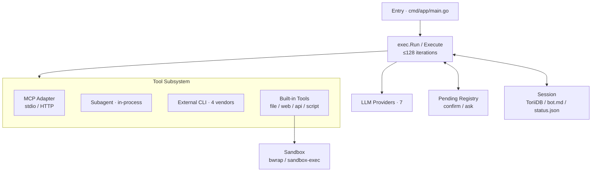

> [!NOTE]
> This README was generated by [SKILL](https://github.com/pardnchiu/skill-readme-generate), get the ZH version from [here](./doc/README.zh.md). 
> Tests are generated by [SKILL](https://github.com/pardnchiu/skill-coverage-generate).

***

  <picture style="margin-down: 1rem">
    
  </picture>

  <strong>Run every vendor against the same task — in parallel, in-process.</strong>

  Go-native multi-agent runtime · Heterogeneous LLM dispatch in one fan-out · OS-level sandbox by default

  
  
  
  

***

## Why Agenvoy

- **Can one task fan out to multiple vendors at once?** Claude planning, GPT diffing, Gemini critiquing — running side by side in the same goroutine batch, no HTTP between them?
- **What is the cost of switching providers?** A config edit, or rewriting every tool integration?
- **Where does the sandbox boundary sit?** Around the agent's own bash tool, or around the entire framework including the external CLIs you delegate to?

Agenvoy is built around those questions:

|                              | Agenvoy                          | Claude Code                              | Codex CLI                                | Gemini CLI                               | OpenClaw                                 | Hermes Agent                             |
| ---------------------------- | -------------------------------- | ---------------------------------------- | ---------------------------------------- | ---------------------------------------- | ---------------------------------------- | ---------------------------------------- |
| Language / runtime           | Go (single binary)               | Node.js                                  | Rust                                     | Node.js                                  | Node.js                                  | Python                                   |
| Native model coverage        | 7 providers + planner            | 1 (Anthropic only — others via proxy)    | 1 (OpenAI only — `--oss` for Ollama)     | 1 (Google only — others via proxy)       | Multi (Anthropic / OpenAI / Gemini / DeepSeek / etc.) | 18+ providers (Nous Portal, OpenRouter, NIM, OpenAI, Anthropic, ...) |
| Sandbox                      | Whole framework + delegated CLIs | Own bash tool only                       | Own shell exec only                      | Own shell exec only (opt-in)             | Skill / shell only (opt-in, 17% defense rate) | Own terminal backend only                |
| Heterogeneous parallel dispatch | In-process fan-out — `invoke_subagent` picks any of 7 providers per call, all run in one goroutine batch | Single vendor                       | Single vendor                            | Single vendor                            | Sub-agents over HTTP                     | Parallel sub-agents over HTTP / RPC      |
| Multi-model iterative verification | codex ↔ claude ↔ copilot ↔ gemini, up to 3 rounds | ✗                        | ✗                                        | ✗                                        | ✗                                        | ✗                                        |
| Cross-session error memory   | ToriiDB + 90-day TTL + semantic search | Vendor-managed history             | Vendor-managed rollouts                  | Vendor-managed history                   | Memory wiki + active memory              | Auto-generated skills + conversation search |
| Primary distribution         | `make build` → single binary     | npm + native installer                   | npm (Rust binary)                        | npm                                      | npm + daemon                             | curl install script                      |

The row that matters most is **Heterogeneous parallel dispatch**. Other frameworks either pin you to one vendor (Claude Code, Codex, Gemini CLI) or push sub-agents through HTTP / RPC (OpenClaw, Hermes). Agenvoy fans out from one `invoke_subagent` call — any of seven providers per slot, parallel goroutines in one process, results merging through a single event stream. **Multi-model iterative verification** stacks on top: four external CLIs cross-check one result for up to three rounds. **Sandbox** is the floor — every delegated CLI sits inside one `go-pkg/sandbox` boundary, one policy.

## Features

> `make build` · installs to `/usr/local/bin/agen` · [Documentation](https://github.com/agenvoy/Agenvoy/wiki)

- **Heterogeneous parallel dispatch** 
  `invoke_subagent` is `Concurrent: true` with a `model` enum across seven providers — the parent fans out Claude / GPT / Gemini in one goroutine batch, no HTTP, one event stream back. `cross_review_with_external_agents` stacks codex / claude / copilot / gemini on top for up to three review rounds.
- **Pluggable tools, one sandbox** 
  Drop `extensions/apis/*.json` or `extensions/scripts/<name>/` to register a tool; MCP (stdio + HTTP/SSE) merges global and per-session config. Every command, script, and external CLI runs inside `go-pkg/sandbox` (bwrap / sandbox-exec).
- **Cross-session error memory** 
  ToriiDB indexes tool failures and turns with a 90-day TTL that refreshes on hit; `search_error_memory` and `search_conversation_history` run keyword + semantic in parallel — the same trap isn't hit twice.

## Architecture

> [Full Architecture](https://github.com/agenvoy/Agenvoy/wiki/Architecture)

## License

This project is licensed under the [Apache License 2.0](LICENSE).

## Contributor

Just [open an issue](https://github.com/pardnchiu/agenvoy/issues/new) to share an idea.

## Star History

<a href="https://star-history.com/#pardnchiu/agenvoy&Date">
  <picture>
    <source media="(prefers-color-scheme: dark)" srcset="https://api.star-history.com/svg?repos=pardnchiu/agenvoy&type=Date&theme=dark&cache_bust=2026-05-05" />
    <source media="(prefers-color-scheme: light)" srcset="https://api.star-history.com/svg?repos=pardnchiu/agenvoy&type=Date&cache_bust=2026-05-05" />
    
  </picture>
</a>

When the curve trends up — that's the signal we want to see. Hit ★ to push it along.

***

©️ 2026 [邱敬幃 Pardn Chiu](https://www.linkedin.com/in/pardnchiu)
