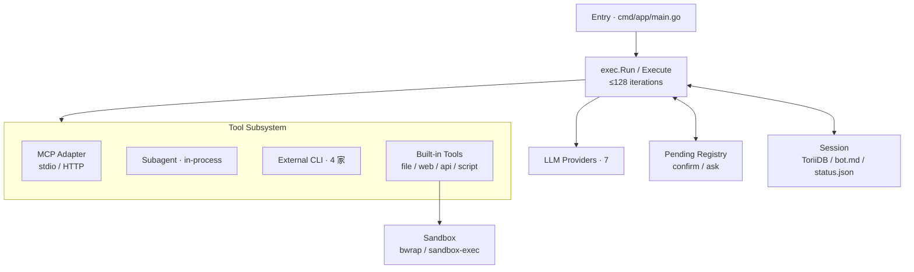

> [!NOTE]
> 此 README 由 [SKILL](https://github.com/pardnchiu/skill-readme-generate) 生成，英文版請參閱 [這裡](../README.md)。 
> 測試由 [SKILL](https://github.com/pardnchiu/skill-coverage-generate) 生成。

***

<picture style="margin-down: 1rem">

</picture>

<strong>把每家 vendor 同時派上同一任務 —— 並行、in-process。</strong>

Go-native 多 agent runtime · 異質 LLM 一次 fan-out · OS-native 沙箱預設

***

## 為什麼 Agenvoy

- **同一任務能不能 fan-out 給多家 vendor？** Claude 規劃、GPT diff、Gemini 批判 —— 同一個 goroutine batch 並行跑，彼此之間沒有 HTTP？
- **換 provider 的成本是什麼？** 改一行 config，還是重寫所有 tool integration？
- **沙箱邊界劃在哪？** 只圈住 agent 自己的 bash tool，還是包含整個框架（含你委派的外部 CLI）？

Agenvoy 圍繞這幾個問題建構：

|                              | Agenvoy                          | Claude Code                              | Codex CLI                                | Gemini CLI                               | OpenClaw                                 | Hermes Agent                             |
| ---------------------------- | -------------------------------- | ---------------------------------------- | ---------------------------------------- | ---------------------------------------- | ---------------------------------------- | ---------------------------------------- |
| 語言 / runtime               | Go（單一 binary）                | Node.js                                  | Rust                                     | Node.js                                  | Node.js                                  | Python                                   |
| 原生模型支援                 | 7 家 provider + planner          | 1（僅 Anthropic — 其餘走 proxy）         | 1（僅 OpenAI — `--oss` 接 Ollama）       | 1（僅 Google — 其餘走 proxy）            | 多家（Anthropic / OpenAI / Gemini / DeepSeek 等）| 18+ 家 provider（Nous Portal、OpenRouter、NIM、OpenAI、Anthropic 等）|
| 沙箱                         | 整個框架 + 委派 CLI              | 僅 own bash tool                         | 僅 own shell exec                        | 僅 own shell exec（opt-in）              | Skill / shell（opt-in、17% 防禦率）      | 僅 own terminal backend                  |
| 異質並行派發                 | In-process fan-out — `invoke_subagent` 每次呼叫從 7 家挑一家，整批同 goroutine 跑 | 單 vendor                              | 單 vendor                                | 單 vendor                                | Sub-agent 走 HTTP                        | 並行 sub-agent 走 HTTP / RPC             |
| 多模型迭代驗證               | codex ↔ claude ↔ copilot ↔ gemini、最多 3 輪 | ✗                              | ✗                                        | ✗                                        | ✗                                        | ✗                                        |
| 跨 session 錯誤記憶          | ToriiDB + 90 天 TTL + 語意檢索   | Vendor 管 history                        | Vendor 管 rollout                        | Vendor 管 history                        | Memory wiki + active memory              | 自動生成 skill + 對話檢索                |
| 主要安裝方式                 | `make build` → 單一 binary       | npm + native installer                   | npm（Rust binary）                       | npm                                      | npm + daemon                             | curl install script                      |

最關鍵的一行是 **異質並行派發**。其他框架要嘛綁定單一 vendor（Claude Code、Codex、Gemini CLI），要嘛 sub-agent 走 HTTP／RPC（OpenClaw、Hermes）。Agenvoy 從同一個 `invoke_subagent` fan-out —— 每次呼叫挑七家其一、整批以並行 goroutine 在同一 process 內跑、結果走單一 event stream 收斂。**多模型迭代驗證** 疊在上層：四家外部 CLI 對單一結果交叉檢核最多三輪。**沙箱** 是底層地基 —— 每個被委派的 CLI 都關進同一個 `go-pkg/sandbox` 邊界、套同一份 policy。

## 功能特點

> `make build` · 安裝至 `/usr/local/bin/agen` · [完整文件](https://github.com/agenvoy/Agenvoy/wiki)

- **異質並行派發** 
  `invoke_subagent` 標 `Concurrent: true`、`model` 從七家 provider enum 選 —— parent 在同一個 goroutine batch fan-out Claude／GPT／Gemini，無 HTTP，事件回流走同一條 stream。`cross_review_with_external_agents` 在此之上把 codex／claude／copilot／gemini 串成最多三輪互審。
- **可插拔工具，單一沙箱** 
  `extensions/apis/*.json` 或 `extensions/scripts/<name>/` 丟入即成 tool；MCP（stdio + HTTP/SSE）自動合併 global 與 per-session 設定。所有 command／script／外部 CLI 一律進 `go-pkg/sandbox`（bwrap／sandbox-exec）。
- **跨 session 錯誤記憶** 
  ToriiDB 將 tool 失敗與對話 turn 索引化，TTL 90 天、命中即續期；`search_error_memory` 與 `search_conversation_history` 並聯 keyword + semantic —— 同個雷不踩第二次。

## 架構

> [完整架構](https://github.com/agenvoy/Agenvoy/wiki/架構)

## 授權

本專案採用 [Apache License 2.0](../LICENSE)。

## 貢獻者

想丟想法 [開個 issue](https://github.com/pardnchiu/agenvoy/issues/new) 聊聊也行。

## Star History

<a href="https://star-history.com/#pardnchiu/agenvoy&Date">
  <picture>
    <source media="(prefers-color-scheme: dark)" srcset="https://api.star-history.com/svg?repos=pardnchiu/agenvoy&type=Date&theme=dark&cache_bust=2026-05-05" />
    <source media="(prefers-color-scheme: light)" srcset="https://api.star-history.com/svg?repos=pardnchiu/agenvoy&type=Date&cache_bust=2026-05-05" />
    
  </picture>
</a>

曲線往上走 —— 那就是我們想看到的訊號。點 ★ 推它一把。

***

©️ 2026 [邱敬幃 Pardn Chiu](https://www.linkedin.com/in/pardnchiu)
