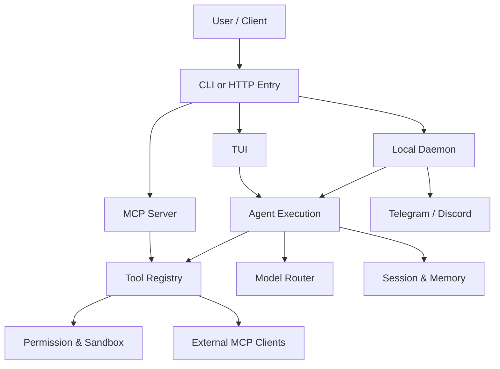
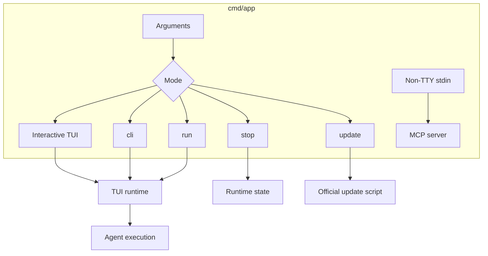
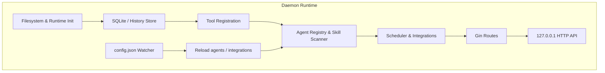
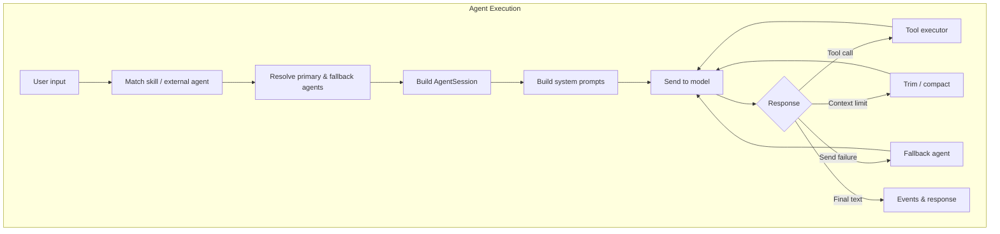
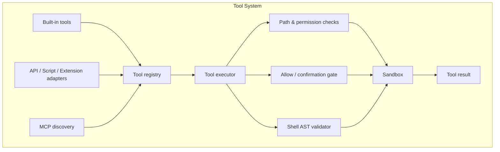
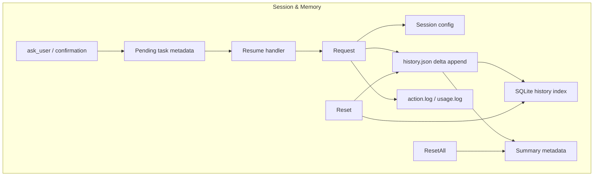
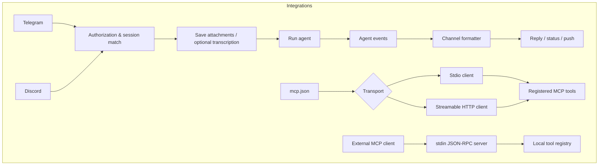
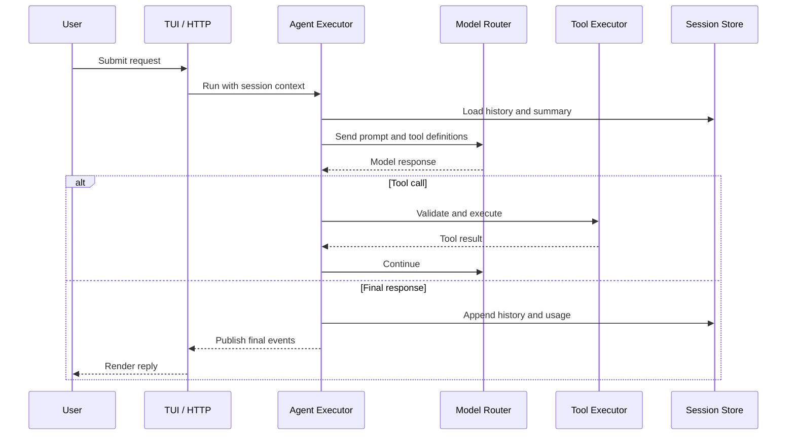
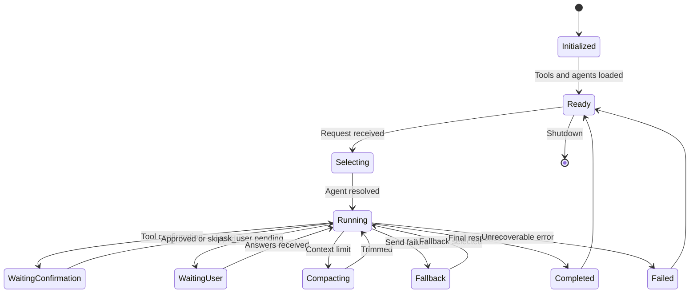
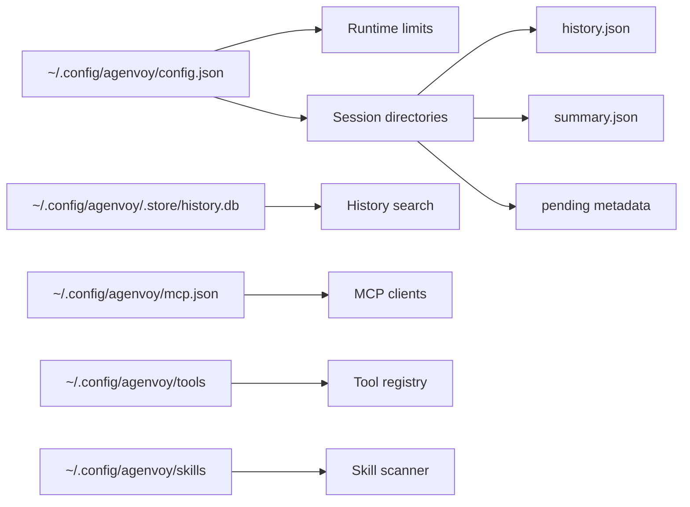

# Agenvoy - Architecture

> Back to [README](../README.md)

## Overview

Agenvoy is a local Go agent runtime that combines an interactive terminal interface, a local HTTP daemon, chatbot integrations, and MCP client/server capabilities. The runtime shares one execution engine for model routing, session-aware tools, skills, and persistent history.

## Module: Entry Points

The `cmd/app` binary runs the TUI by default. `agen cli <input>` retains per-tool confirmation, while `agen run <input>` allows tools for that run subject to sandbox policy. `agen stop` stops the daemon, `agen update` runs the official updater, and non-terminal stdin activates the MCP server.

## Module: Daemon and HTTP API

The daemon initializes the filesystem, runtime limits, ToriiDB/history storage, registered tools, agents, schedulers, chatbots, and Gin routes. The HTTP API binds locally and exposes agent execution, OpenAI-compatible chat completions, direct tool calls, sessions, models, logs, and pending-task recovery.

## Module: Agent Execution and Routing

A request is matched to a skill, an external agent, or a configured model. The executor builds system prompts and a session, sends messages to the selected model, loops through tool calls, trims context when needed, and moves to fallback agents when a send attempt fails.

## Module: Tool Registry and Sandbox

Built-in tools and discovered API, script, extension, and MCP tools enter one registry. Before execution, file and command operations pass through denied-path checks, allow rules, confirmation gates, shell validation, and sandbox enforcement.

## Module: Sessions, History, and Pending Work

Sessions persist configuration, model selection, message history, summaries, logs, usage, and pending interactive work. History appends deltas to `history.json` and mirrors searchable content to SQLite. Pending questions retain task metadata and resume through registered channel handlers.

## Module: Chat and MCP Integrations

Telegram and Discord use a shared event pipeline with channel-specific authorization, attachment handling, pending confirmations, formatting, and push delivery. External MCP servers are consumed through stdio or streamable HTTP; Agenvoy can also expose local tools as a stdin JSON-RPC MCP server.

## Data Flow

## State Machine

## Security Boundaries

- The HTTP daemon binds to `127.0.0.1`; selected endpoints apply an additional localhost-only guard.
- File operations use denied-path and sensitive-file checks before execution.
- Command execution is subject to allow rules, AST-based shell validation, and sandbox policies.
- `run` mode bypasses confirmation only for its request; sandbox and denied-path protections still apply.
- Credentials are stored through the operating-system keychain integration, not in the repository.

## Persistence Layout

***

©️ 2026 [邱敬幃 Pardn Chiu](https://www.linkedin.com/in/pardnchiu)
