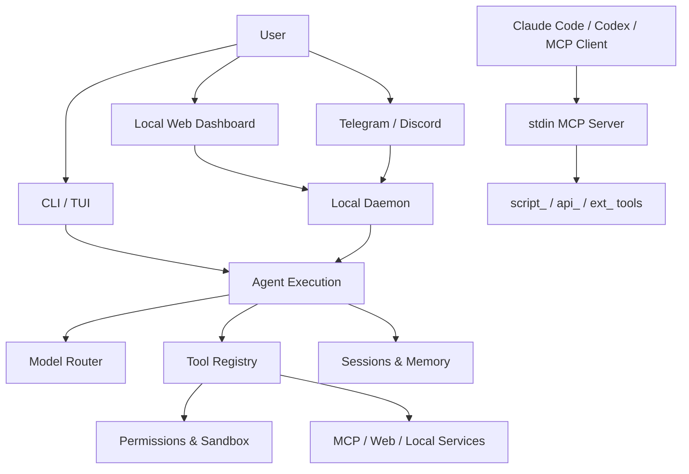
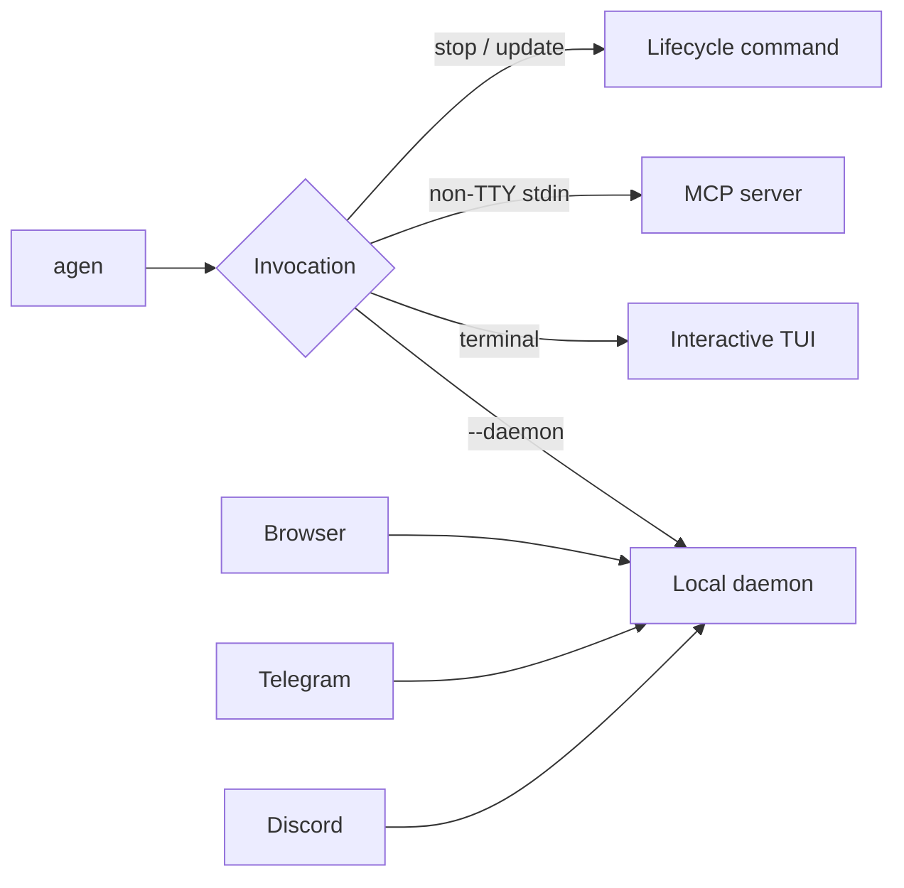
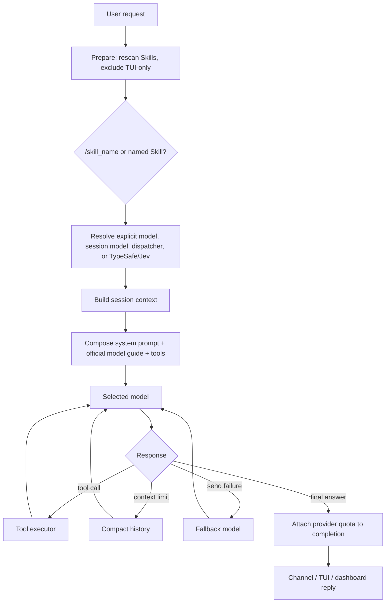
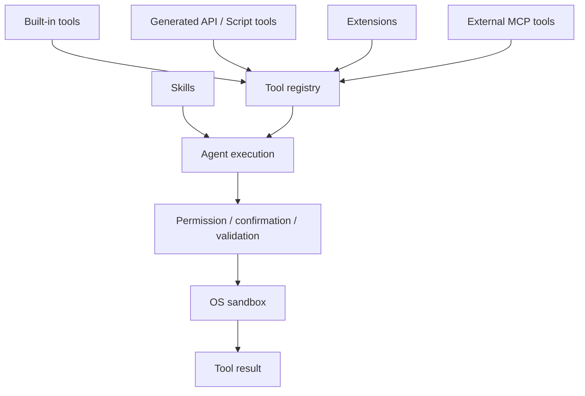
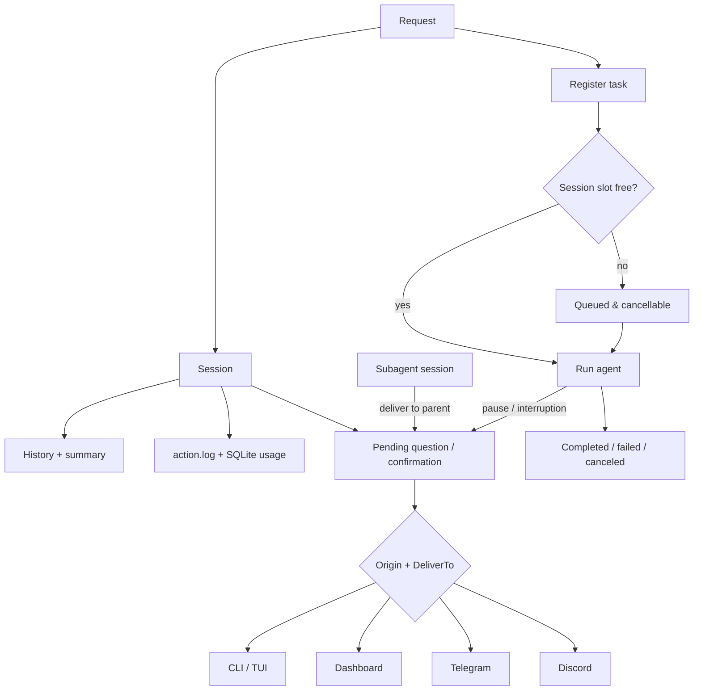
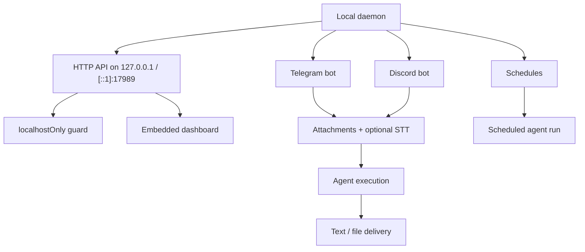
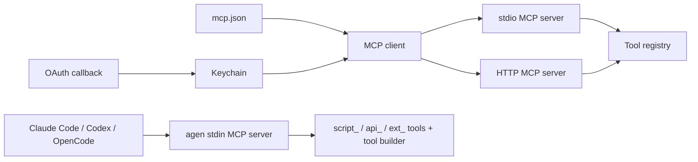
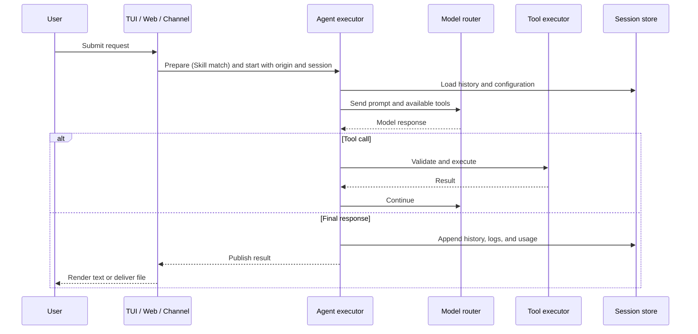
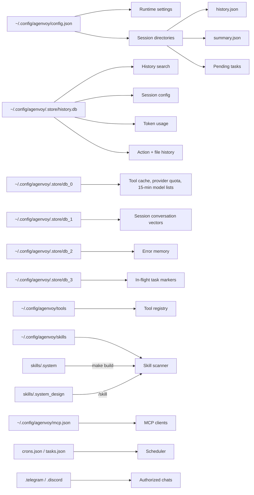

# Agenvoy - Architecture

> Back to [README](../README.md)

## Overview

Agenvoy is a local Go agent runtime. One execution engine powers the interactive TUI, browser dashboard, Telegram and Discord; the stdin MCP server is a separate, narrower surface that exposes only generated and extension tools. The engine routes each request to a configured model, runs Skills and sandboxed tools, persists session history, schedules, and usage locally, and can create tools when a capability is missing.

```mermaid
graph TB
    User[User] --> TUI[CLI / TUI]
    User --> Dashboard[Local Web Dashboard]
    User --> Channels[Telegram / Discord]
    Client[Claude Code / Codex / MCP Client] --> MCPServer[stdin MCP Server]
    TUI --> Exec[Agent Execution]
    Dashboard --> Daemon[Local Daemon]
    Channels --> Daemon
    Daemon --> Exec
    MCPServer --> ToolBox[script_ / api_ / ext_ tools]
    Exec --> Router[Model Router]
    Exec --> Tools[Tool Registry]
    Exec --> Sessions[Sessions & Memory]
    Tools --> Guard[Permissions & Sandbox]
    Tools --> External[MCP / Web / Local Services]
```

## Module: Entry Points

The `agen` binary opens the TUI by default. The local daemon serves the browser dashboard at `http://127.0.0.1:17989` (it also listens on `[::1]:17989`); Telegram and Discord connect outward from that daemon, so no inbound port or public host is required. When stdin is not a terminal, `agen` serves its generated and extension tools through newline-delimited JSON-RPC MCP instead of opening the TUI. The TUI runs the agent in its own process; the daemon runs it for the dashboard, Telegram, Discord and schedules.

Every session-backed surface — TUI, dashboard `/send`, pending resume, Telegram, and Discord — enters execution through the same two steps: `exec.Prepare` rescans Skills, excludes TUI-only tools and Skills outside the TUI, and resolves a leading `/<skill_name>`; `exec.Start` then looks up a Skill passed by name, records the input, resolves the model, builds the session, and runs the agent. Entry points only handle their own transport, authorization, and rendering. Telegram and Discord share one reply pipeline for status updates, chunking, footers, error notices, and attachments. The TUI and the daemon both watch `config.json` and reload the model registry when it changes (the daemon also reconnects the chat bots), and the TUI subscribes to the daemon log so Telegram and Discord verification codes appear in the terminal.

With an empty input box, `Shift+F` toggles fast mode for the current process only; the executor, dispatcher and summary calls pass the mode to `go-llm-router`.

```mermaid
graph LR
    CLI[agen] --> Mode{Invocation}
    Mode -->|terminal| TUI[Interactive TUI]
    Mode -->|--daemon| Daemon[Local daemon]
    Mode -->|non-TTY stdin| MCP[MCP server]
    Mode -->|stop / update| Maintenance[Lifecycle command]
    Dashboard[Browser] --> Daemon
    Telegram[Telegram] --> Daemon
    Discord[Discord] --> Daemon
```

## Module: Agent Execution and Model Routing

The runtime matches a request to a Skill when applicable, then selects the configured primary model and fallbacks. A leading `/<skill_name>` is the only inline syntax, and the matched Skill's description is passed to model selection as a routing hint; delegating to a named session goes through the `subagents` tool with a `self_id`. A model named explicitly by the caller (for example the `model` field of `/send`) is used as-is and fails when it is not registered; otherwise the session-bound model or the dispatcher decides. Completion events carry the remaining provider quota — a percentage for `codex`, `grok-oauth`, `copilot`, and `ollama-cloud`, a balance for `openrouter` and `deepseek` — fetched once before the event is delivered, so the TUI footer, dashboard badge, and chat footers all show the same value. They also carry the reasoning level actually used, shown as `model(quota)/reasoning` and recorded as `reasoning=` on the `action.log` `done` line. Dispatcher, summary, image generation, speech-to-text (STT), and text-to-speech (TTS) are separate optional roles. Registered models keep a user-defined priority order that decides fallback, tried top to bottom after the selected model fails, `pass`-tier models included. Each model can carry a tier (`S` `A` `B` `C` `pass`) in `model_tag`; the dispatcher orders tiers by the kind of work, defaulting to A, and when one model is registered under several providers it prefers `codex` / `grok-oauth`, then `copilot`, then the direct API, then `openrouter`. With `dispatcher_beta` on, the TypeSafe `jev-latest` model replaces the dispatcher model. It classifies the request as `code`, `chat`, `fetch`, `research` or `work`, flags an explicitly named model, and asks whether the request continues the last one so the session's previous model can be kept for cache reuse; code then ranks models by the tier order for that work type (`research` S first, `work` A first), and any TypeSafe error falls back to the dispatcher model. With `auto_reasoning` on, the same classification also sets the reasoning level (`xhigh`, `none`, `low`, `high`, `medium`), even for sessions pinned to a model; a level passed with the request still wins. Subagent legs are sized by the same tiers according to their job. Local OpenAI-compatible endpoints are registered as `<name>@<model>`; custom endpoint URLs are kept under `compats` in `config.json`, while the Ollama and llama.cpp defaults that `/model add` detects on their usual ports are built in. History is compacted once it reaches 80% of the model's input window. Window sizes come from `llm-io.agenvoy.com`, refreshed at most hourly before a run and keyed by vendor and model (`nvidia` and `openrouter` models resolve through the vendor inside the model name); when a model is not listed, `copilot@` models assume 256K and everything else 128K. During prompt assembly it injects `official_guides/_base.md` for every model, followed by the guide whose file name the model name contains (longest match wins), or `_base_unlisted.md` when no guide matches. The recommended way to try Agenvoy for free is `gemma4:31b` on `ollama-cloud` (free API key with a usage cap); it is not a required dispatcher or primary model.

```mermaid
graph TB
    Input[User request] --> Prepare[Prepare: rescan Skills, exclude TUI-only]
    Prepare --> Skill{/skill_name or named Skill?}
    Skill --> Select[Resolve explicit model, session model, dispatcher, or TypeSafe/Jev]
    Select --> Session[Build session context]
    Session --> Prompt[Compose system prompt + official model guide + tools]
    Prompt --> Model[Selected model]
    Model --> Result{Response}
    Result -->|tool call| ToolExec[Tool executor]
    ToolExec --> Model
    Result -->|context limit| Compact[Compact history]
    Compact --> Model
    Result -->|send failure| Fallback[Fallback model]
    Fallback --> Model
    Result -->|final answer| Quota[Attach provider quota to completion]
    Quota --> Output[Channel / TUI / dashboard reply]
```

## Module: Tools, Skills, and Sandbox

Built-in tools, generated API/script tools, installed extensions, and MCP tools share one registry. Tools load their full schema only when needed to keep routine requests lightweight. Before execution, the executor checks denied and sensitive paths, command policy, confirmation requirements, argument validation, shell AST validation for `run_command`, and the OS sandbox. A normal tool confirmation asks whether to allow that specific tool call. Restricted paths and package-management operations additionally require system verification where the channel supports it. Denied paths and configured denied commands are hard rejected; commands outside the denylist are not an allowlist failure, though they can still enter the normal confirmation flow.

File tools resolve paths through a shared boundary check. `find_files` supports directory listing, filename globbing, and regex content search. Glob results are ordered most recently modified first. Search is paged: `output=files` returns each matching path with its match count and the row numbers of its first five matches, so a precise query can go straight to `read_files`; `output=content` returns the matching lines with optional `context`; `multiline` matches the regex against whole files so `.` crosses newlines while `^` and `$` still anchor lines. Serialized results are capped at 128 KiB. `read_files` handles text and supported document, image, and audio/video formats in batches, with text reads paged at 2048 lines by default. For plain-text files, `around` reads `context` lines (20 by default) on both sides of given rows, merges overlapping windows, and marks skipped text with a `...` line; one path may appear several times in a call and its results are joined in order. `edit_file` provides write, patch, remove, and restore modes. Writing or patching an existing file requires that `read_files` recorded its modification time earlier in the same run and that the on-disk modification time is still unchanged; successful writes refresh that mark, so consecutive patches need no re-read. When a patch anchor does not match exactly, it is retried with curly quotes treated as straight ones, and the replacement keeps the file's curly-quote style. File changes are recorded in SQLite history where available; a failed history record does not undo a completed filesystem write and is reported to the caller. Long-form deliverables go through `write_result` (Markdown or HTML), which writes to the configured output directory (`output_dir`; `~/Downloads` by default, or `~/.config/agenvoy/download` when that folder does not exist) rather than the work directory. Other files made for the user land there too unless the request names a location. `run_command` waits for the process to exit, so commands that start a file watcher (`--watch`, `chokidar`, or a package script that runs one, followed through `sh -c` and `package.json`) are refused before they run. If live data needs a tool that does not exist, the agent can build, test, and retain a new tool. Web Search and file search provide live or local data directly; RAG has no built-in tool and comes from an external MCP server.

Skills are scanned in a fixed order and the first Skill with a given name wins: `<cwd>/.skills`, `<cwd>/.claude/skills`, `~/.config/agenvoy/skills/.system`, `~/.config/agenvoy/skills/.system_design`, `~/.config/agenvoy/skills`, then `~/.claude`, `~/.codex`, `~/.opencode`, and `~/.openai` skills. Other dot-folders inside a scanned directory are skipped. `.system` is rebuilt from `extensions/skills` on every `make build`. `.system_design` holds the official Skills that the TUI `/skill` command clones from `github.com/agenvoy/skill-<name>` (checked) or deletes (unchecked), so a rebuild never removes them. Skills in both folders report their source as `system`, and the dashboard cannot delete them. Activating a Skill by `/<name>` injects the execution rules and the resolved SKILL.md as one system message, and adds a synthetic `run_skill` call with a one-line pointer as its tool result — the pair keeps the message sequence valid without loading the content twice, and the system message is the copy that survives compaction, which clears tool history.

```mermaid
graph TB
    Builtin[Built-in tools] --> Registry[Tool registry]
    Generated[Generated API / Script tools] --> Registry
    Extension[Extensions] --> Registry
    Remote[External MCP tools] --> Registry
    Skill[Skills] --> Agent[Agent execution]
    Registry --> Agent
    Agent --> Check[Permission / confirmation / validation]
    Check --> Sandbox[OS sandbox]
    Sandbox --> Result[Tool result]
```

## Module: Sessions, Memory, and Task Lifecycle

Every request belongs to a session. The session ID prefix marks its origin: `cli-`, `chat-`, `tg-`, `dc-`, or `temp-`. Session configuration, token usage, action history and file history are stored in SQLite (`history.db`); session directories keep messages, summaries, `action.log`, and pending questions. Active tasks publish short-lived `action:<session>:<task>` markers in ToriiDB and refresh them while running, so pending lists expose only tasks that can actually be resumed. Pending requests have two routing keys: `Origin` selects the listener (CLI/TUI, web, Telegram, or Discord), while `DeliverTo` selects the session window that receives the prompt and result. A subagent runs in its own session but inherits the parent origin and delivers confirmations and `ask_user` prompts back to the parent session. An `ask_user` raised from the TUI is asked inline and the run stays alive; from every other origin the run stops and its state is written to a pending entry, with tool arguments capped at 1 KiB and results at 4 KiB, that a later answer resumes. Tasks are registered before they compete for a per-session concurrency slot, so queued work remains visible and cancellable. A user cancel (TUI cancel or `ctrl+c`, **Abort task**, the cancel API) discards the task's pending entry; a pause or any other interruption stops the run but keeps the entry resumable. The scheduler runs recurring or one-shot scheduler Skills.

```mermaid
graph TB
    Request[Request] --> Session[Session]
    Session --> History[History + summary]
    Session --> Logs[action.log + SQLite usage]
    Session --> Pending[Pending question / confirmation]
    Pending --> Routing{Origin + DeliverTo}
    Routing --> CLI[CLI / TUI]
    Routing --> Web[Dashboard]
    Routing --> TG[Telegram]
    Routing --> DC[Discord]
    Subagent[Subagent session] -->|deliver to parent| Pending
    Request --> Register[Register task]
    Register --> Gate{Session slot free?}
    Gate -->|yes| Execute[Run agent]
    Gate -->|no| Queue[Queued & cancellable]
    Queue --> Execute
    Execute --> Finish[Completed / failed / canceled]
    Execute -->|pause / interruption| Pending
```

## Module: Daemon, Dashboard, and Chat Channels

The daemon initializes ToriiDB before SQLite, clears stale in-flight markers, then opens the history database before starting the local HTTP server. It registers the web confirmation listener before serving the loopback API. Its dashboard is embedded in the binary and served by the same daemon. The HTTP API listens on `127.0.0.1` and `[::1]` only; on top of that, `localhostOnly()` guards local management routes including session management, model and provider configuration, credentials, MCP configuration, rules, Skills, schedules, allowlists and runtime configuration. Agent execution (`/send`, `/v1/chat/completions`), confirmation, cancellation, pending tasks, session and model lists, the SSE log and `/v1/mcp/tools` remain available on the unguarded loopback surface. The dashboard's System tab compares the running version with the latest GitHub release and can open a terminal running `agen update` (Terminal.app on macOS, `cmd.exe` into the WSL distro, or a Linux terminal emulator). Telegram and Discord require only their bot tokens because the daemon initiates the connection. Since **v0.34.4**, the default voice-input-to-voice-output loop is paused for those channels; STT/TTS tools can still generate audio files and send them through either channel.

```mermaid
graph TB
    Daemon[Local daemon] --> API["HTTP API on 127.0.0.1 / [::1]:17989"]
    API --> Guard[localhostOnly guard]
    API --> Dashboard[Embedded dashboard]
    Daemon --> Scheduler[Schedules]
    Daemon --> Telegram[Telegram bot]
    Daemon --> Discord[Discord bot]
    Telegram --> Attachment[Attachments + optional STT]
    Discord --> Attachment
    Attachment --> ChannelRun[Agent execution]
    ChannelRun --> Delivery[Text / file delivery]
    Scheduler --> ScheduledRun[Scheduled agent run]
```

## Module: MCP Client and Server

Agenvoy connects to external MCP servers over stdio or streamable HTTP through the official `go-sdk` client, refreshes their tools when their catalog changes, adds their server instructions to the agent system prompt, and can complete OAuth sign-in while storing the token and client id in the keychain. In the other direction, running `agen` with non-terminal stdin serves an MCP server to Claude Code, Codex, OpenCode, and other MCP-compatible clients. It does not share the agent's tool registry or run the agent: it exposes only `script_*`, `api_*` and `ext_*` tools plus `tool_generate_guide`, `list_tools`, `edit_tool`, `test_tool` and `store_secret`, so a client can find, build and call generated tools.

```mermaid
graph LR
    Config[mcp.json] --> MCPClient[MCP client]
    MCPClient --> Stdio[stdio MCP server]
    MCPClient --> HTTP[HTTP MCP server]
    Stdio --> Registry[Tool registry]
    HTTP --> Registry
    External[Claude Code / Codex / OpenCode] --> MCPServer[agen stdin MCP server]
    MCPServer --> ToolBox[script_ / api_ / ext_ tools + tool builder]
    OAuth[OAuth callback] --> Keychain[Keychain]
    Keychain --> MCPClient
```

## Data Flow

```mermaid
sequenceDiagram
    participant User
    participant Entry as TUI / Web / Channel
    participant Exec as Agent executor
    participant Router as Model router
    participant Tools as Tool executor
    participant Store as Session store

    User->>Entry: Submit request
    Entry->>Exec: Prepare (Skill match) and start with origin and session
    Exec->>Store: Load history and configuration
    Exec->>Router: Send prompt and available tools
    Router-->>Exec: Model response
    alt Tool call
        Exec->>Tools: Validate and execute
        Tools-->>Exec: Result
        Exec->>Router: Continue
    else Final response
        Exec->>Store: Append history, logs, and usage
        Exec-->>Entry: Publish result
        Entry-->>User: Render text or deliver file
    end
```

## Security Boundaries

- The dashboard and HTTP API listen on `127.0.0.1` and `[::1]` only, and management routes additionally pass the `localhostOnly()` guard; the host is not exposed for normal browser or chatbot use.
- Telegram and Discord use outbound connections from the local daemon and need only a bot token.
- Denied paths and denied commands are hard rejected. Sensitive paths, file-tool reads and writes outside `$HOME` (`read_files`, `find_files`, `file_history`, `edit_file`, `open_file`), and other restricted actions require explicit confirmation and, where supported, system verification; approval is scoped to the session and requested path or binary.
- Writes and patches to an existing file through `edit_file` must follow a successful `read_files` of it in the same run, and fail if the file modification time changed afterward. New files do not require a prior read. This freshness check supplements path-boundary and permission checks; it does not replace them.
- Command execution goes through shell AST validation and is sandboxed (`sandbox-exec` on macOS and `bwrap` on Linux). `sudo` is refused inside `run_command`; a command that writes outside `$HOME` declares those paths through `write_paths` on that call and is approved with the system password.
- Credentials, including provider and MCP OAuth tokens, are stored in the OS keychain (macOS Keychain, `secret-tool` on Linux) rather than the repository; when `secret-tool` fails, they fall back to `~/.config/agenvoy/.secrets` with mode 0600.

## Persistence Layout

```mermaid
flowchart LR
    Config[~/.config/agenvoy/config.json] --> Runtime[Runtime settings]
    Config --> Sessions[Session directories]
    Sessions --> History[history.json]
    Sessions --> Summary[summary.json]
    Sessions --> Pending[Pending tasks]
    SQLite[~/.config/agenvoy/.store/history.db] --> Search[History search]
    SQLite --> SessionConfig[Session config]
    SQLite --> Usage[Token usage]
    SQLite --> ActionHistory[Action + file history]
    Torii0[~/.config/agenvoy/.store/db_0] --> ToolCache[Tool cache, provider quota, 15-min model lists]
    Torii1[~/.config/agenvoy/.store/db_1] --> SessionMemory[Session conversation vectors]
    Torii2[~/.config/agenvoy/.store/db_2] --> ErrorMemory[Error memory]
    Torii3[~/.config/agenvoy/.store/db_3] --> Online[In-flight task markers]
    Tools[~/.config/agenvoy/tools] --> Registry[Tool registry]
    Skills[~/.config/agenvoy/skills] --> Scanner[Skill scanner]
    SystemSkills[skills/.system] -->|make build| Scanner
    DesignSkills[skills/.system_design] -->|/skill| Scanner
    MCP[~/.config/agenvoy/mcp.json] --> MCPClient[MCP clients]
    Schedules[crons.json / tasks.json] --> Scheduler[Scheduler]
    Auth[.telegram / .discord] --> Channels[Authorized chats]
```

---

©️ 2026 [邱敬幃 Pardn Chiu](https://www.linkedin.com/in/pardnchiu)
