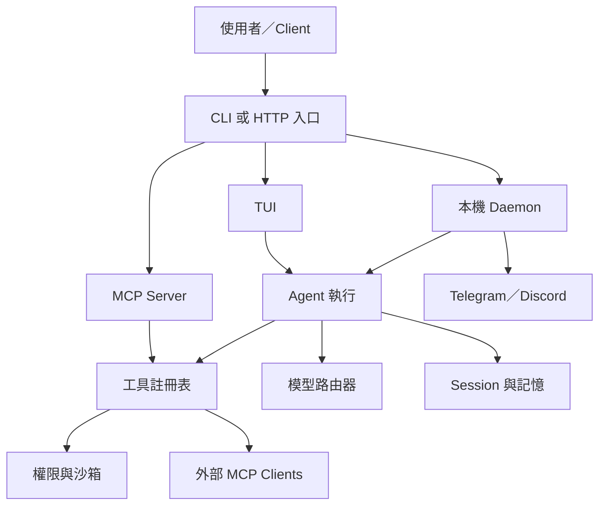
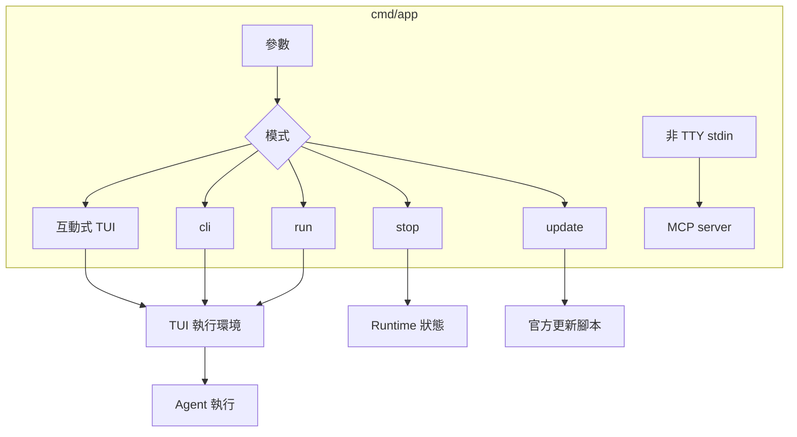
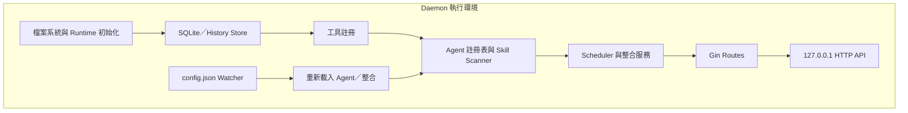
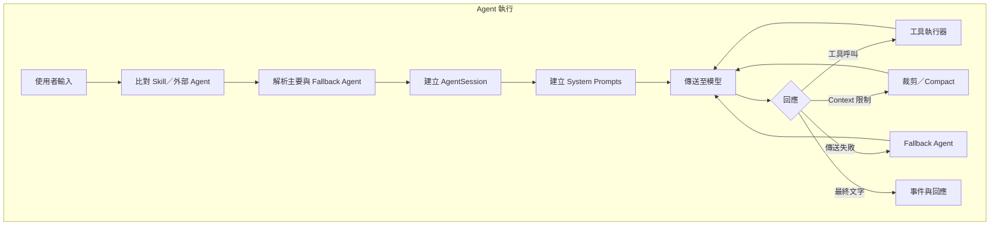
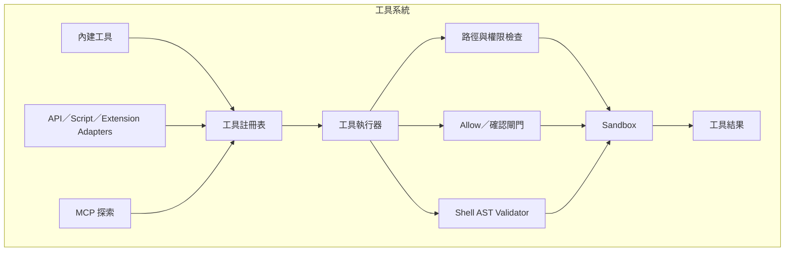
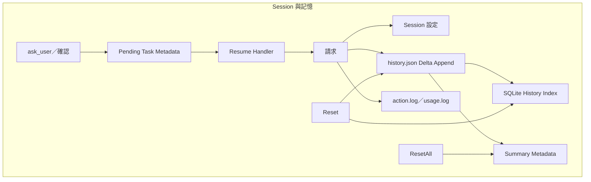
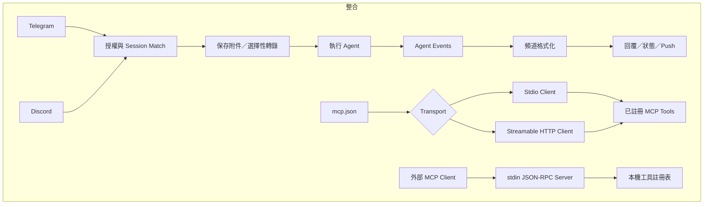
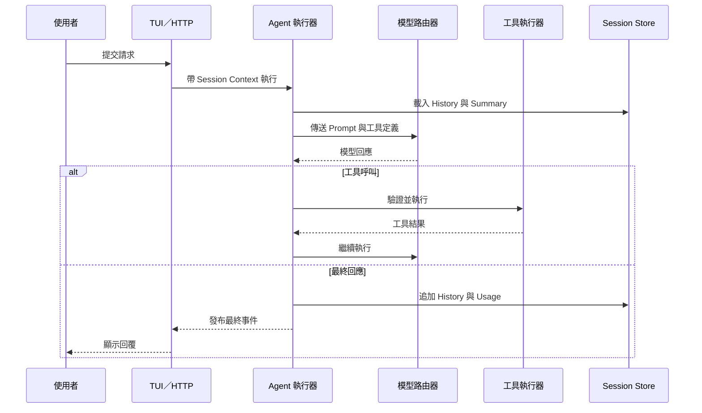
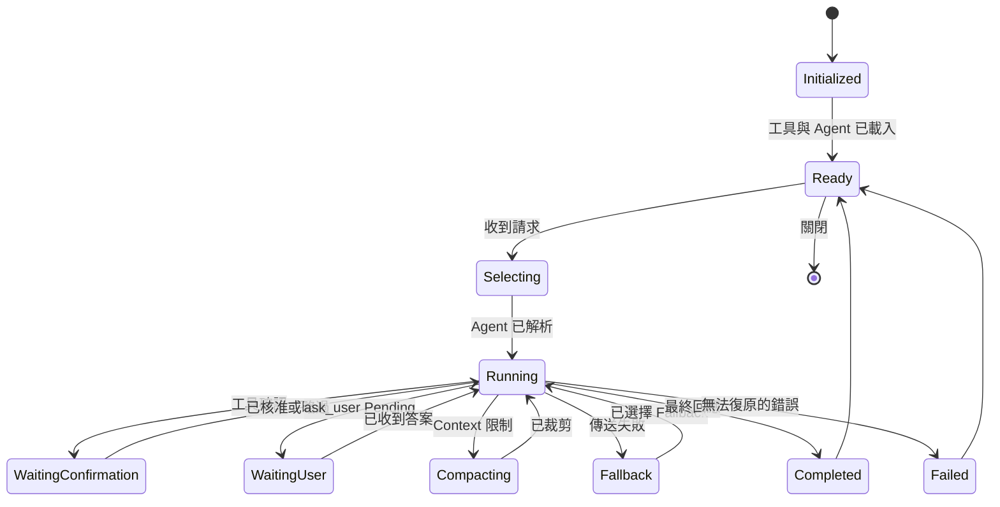
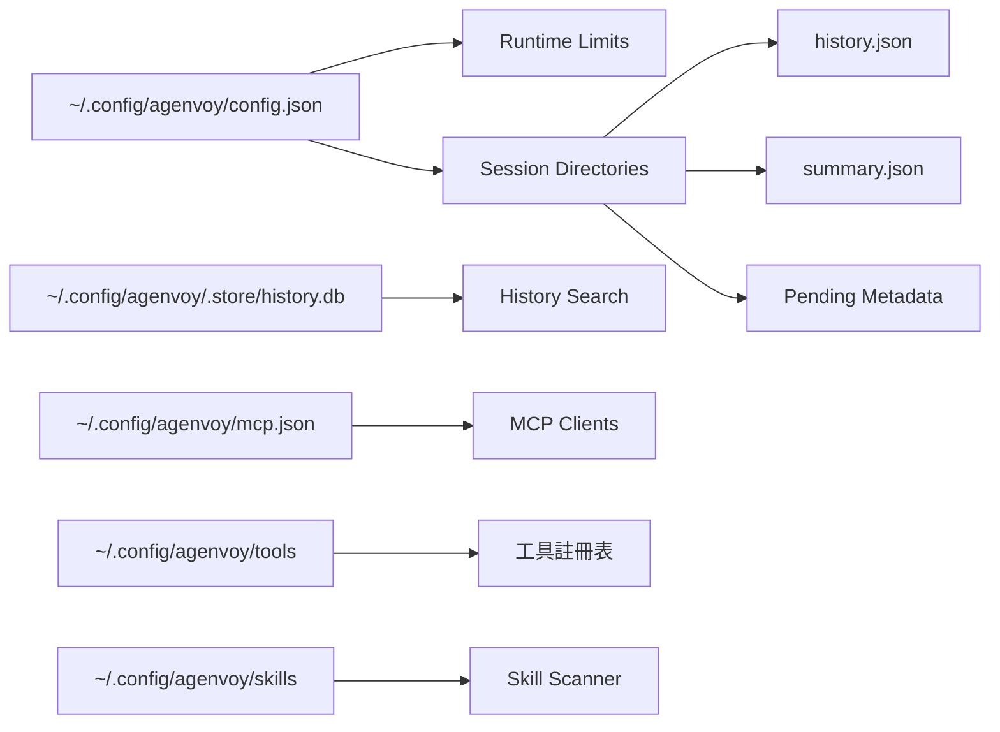

# Agenvoy - 架構

> 返回 [README](./README.zh.md)

## 概覽

Agenvoy 是以 Go 撰寫的本機 Agent 執行環境，整合互動式終端介面、本機 HTTP daemon、聊天機器人整合，以及 MCP client／server 功能。所有進入路徑共用模型路由、session-aware 工具、Skill 與持久化歷史的同一執行引擎。

## 模組：進入點

`cmd/app` 二進位檔預設啟動 TUI。`agen cli <input>` 保留逐次工具確認，`agen run <input>` 則只在該次執行中允許工具自動執行，仍受沙箱政策限制。`agen stop` 停止 daemon，`agen update` 執行官方更新器，而非終端 stdin 會啟動 MCP server。

## 模組：Daemon 與 HTTP API

Daemon 初始化檔案系統、runtime limits、ToriiDB／history 儲存、已註冊工具、Agent、排程器、聊天整合與 Gin routes。HTTP API 僅綁定本機，提供 Agent 執行、OpenAI-compatible chat completions、直接工具呼叫、session、模型、log 與 pending task 恢復能力。

## 模組：Agent 執行與路由

請求會比對至 Skill、外部 Agent 或已設定模型。執行器建立 system prompt 與 session，將訊息傳給選定模型，迭代處理工具呼叫；需要時裁剪 context，若傳送失敗則轉移至 fallback Agent。

## 模組：工具註冊表與沙箱

內建工具與探索到的 API、script、extension、MCP 工具都進入同一註冊表。檔案與命令操作在執行前會通過 denied path、allow rule、確認閘門、shell 驗證與 sandbox enforcement。

## 模組：Session、歷史與 Pending 工作

Session 持久保存設定、模型選擇、訊息歷史、摘要、log、usage 與互動中的 pending 工作。History 會以 delta 方式追加到 `history.json`，並同步可搜尋內容至 SQLite。待回答問題會保留 task metadata，並透過已註冊的 channel handler 恢復。

## 模組：聊天與 MCP 整合

Telegram 與 Discord 採用共用 event pipeline，但保有頻道專屬的授權、附件處理、pending confirmation、格式化與 push delivery。外部 MCP server 可經由 stdio 或 streamable HTTP 使用；Agenvoy 也能以 stdin JSON-RPC MCP server 形式暴露本機工具。

## 資料流

## 狀態機

## 安全邊界

- HTTP daemon 綁定 `127.0.0.1`；部分 endpoint 另有 localhost-only guard。
- 檔案操作在執行前使用 denied path 與 sensitive-file 檢查。
- 命令執行受 allow rule、AST-based shell validation 與 sandbox policy 限制。
- `run` 模式只略過該次 request 的確認，不會略過 sandbox 與 denied-path 保護。
- 憑證透過作業系統 keychain integration 保存，不放在 repository 中。

## 持久化結構

***

©️ 2026 [邱敬幃 Pardn Chiu](https://www.linkedin.com/in/pardnchiu)
