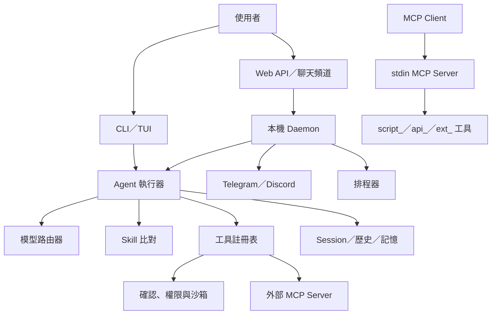
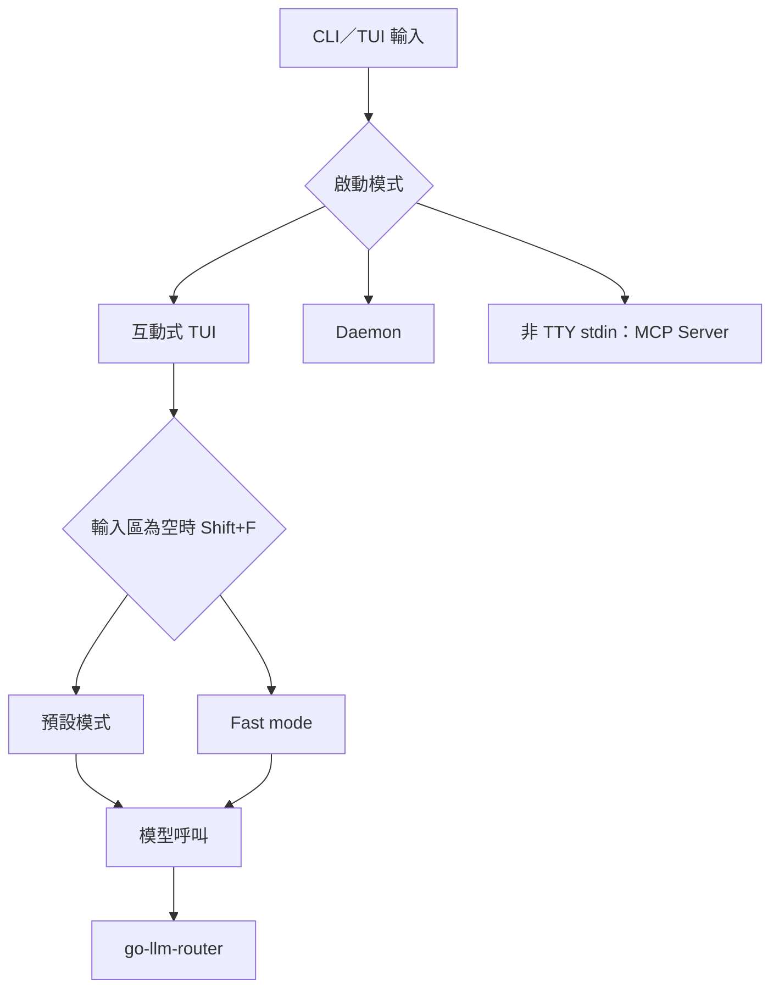
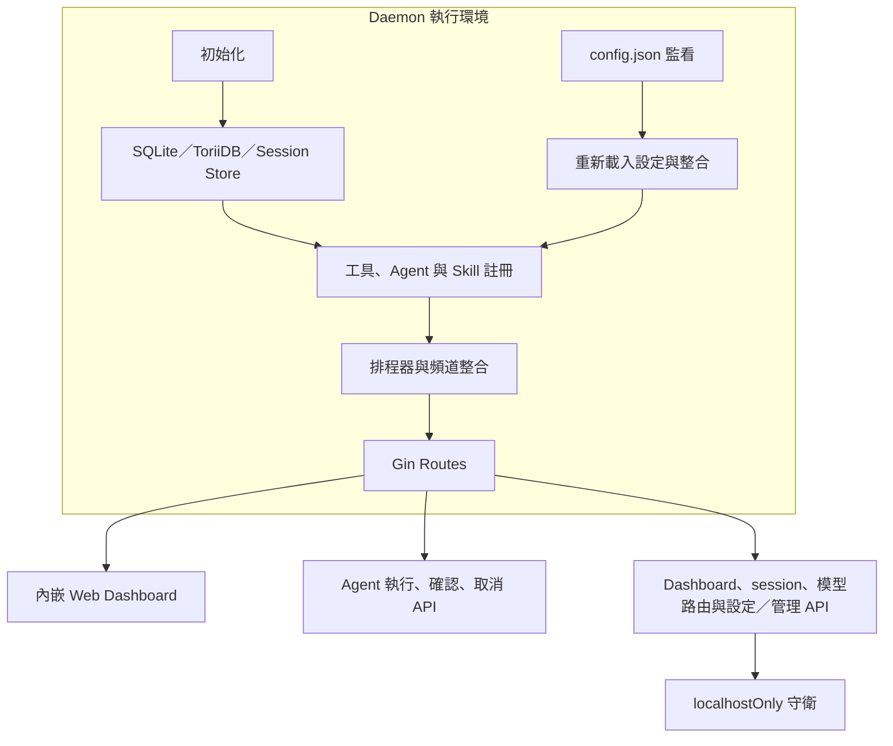
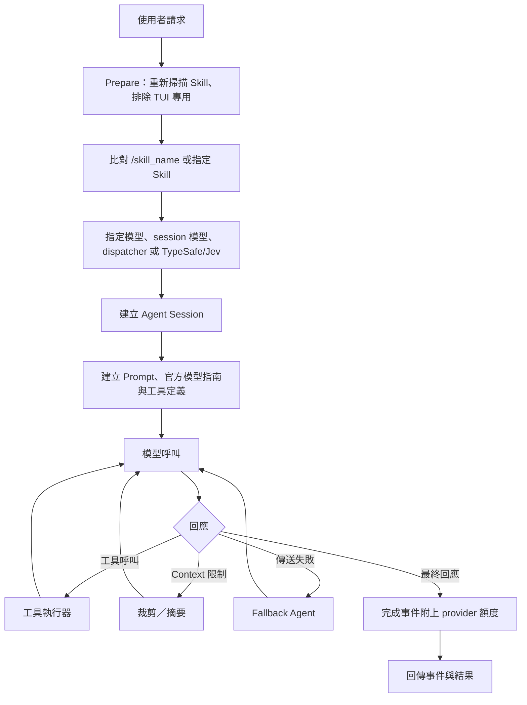
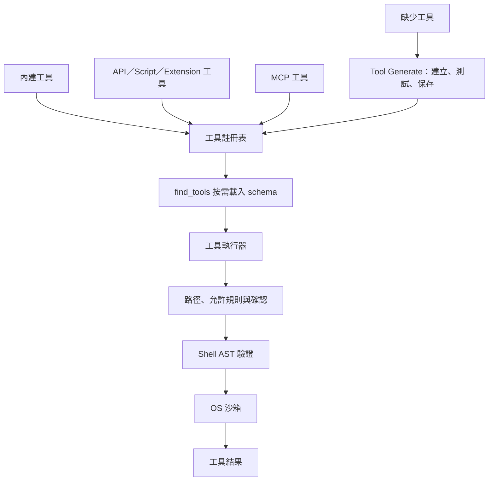
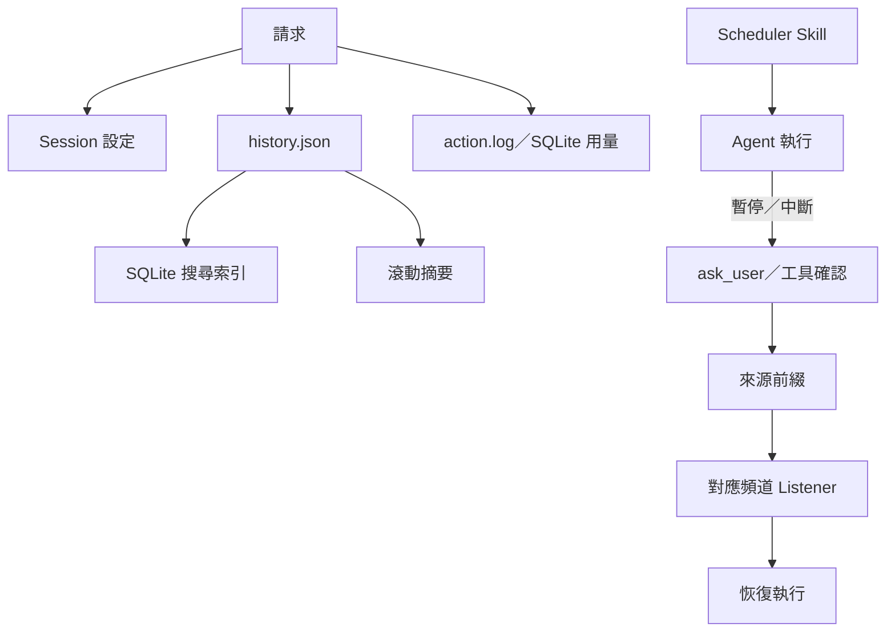
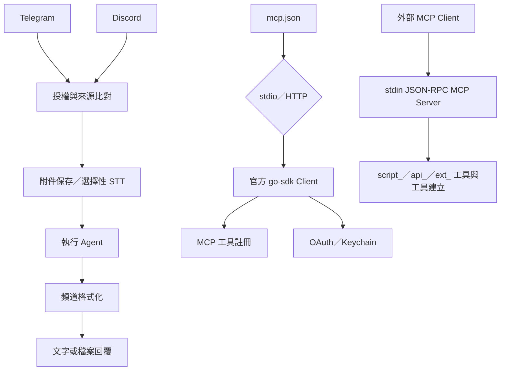
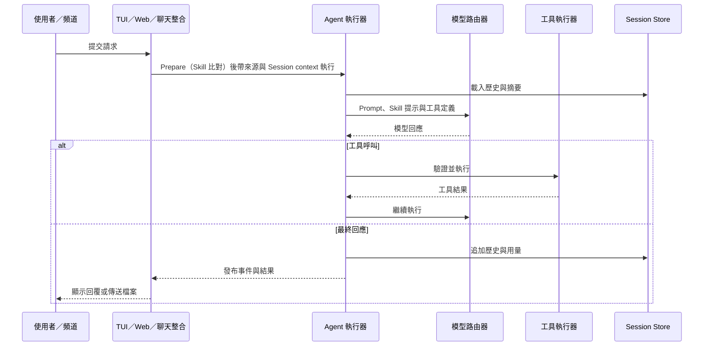
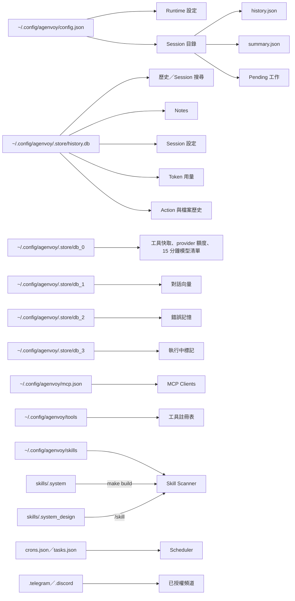

# Agenvoy - 架構

> 返回 [README](./README.zh.md)

## 概覽

Agenvoy 是以 Go 撰寫、在個人電腦上執行的本機 Agent 執行環境。它把 TUI、Web 儀表板、本機 HTTP API、Telegram／Discord 與 MCP client 整合到同一個執行引擎；stdin MCP server 是另一個較窄的介面，只提供生成與 extension 工具，不經過執行引擎。Agent 可依 Skill 與任務選擇模型、呼叫沙箱工具，並將 session、排程、筆記與歷史保留在本機。

```mermaid
graph TB
    User[使用者] --> TUI[CLI／TUI]
    User --> Web[Web API／聊天頻道]
    Client[MCP Client] --> MCPServer[stdin MCP Server]
    TUI --> Exec[Agent 執行器]
    Web --> Daemon[本機 Daemon]
    Daemon --> Exec
    MCPServer --> ToolBox[script_／api_／ext_ 工具]
    Exec --> Router[模型路由器]
    Exec --> Skills[Skill 比對]
    Exec --> Tools[工具註冊表]
    Exec --> Sessions[Session／歷史／記憶]
    Tools --> Guard[確認、權限與沙箱]
    Daemon --> Channels[Telegram／Discord]
    Daemon --> Scheduler[排程器]
    Tools --> MCPClient[外部 MCP Server]
```

## 模組：進入點與執行模式

`cmd/app` 預設開啟 TUI；TUI 在本機直接執行 Agent，daemon 則提供 Web、Telegram 與 Discord 的執行服務。`agen stop` 停止 daemon，`agen update` 執行官方更新器，stdin 非 TTY 時則改為 stdio JSON-RPC MCP server。Web 儀表板由 daemon 提供於 `http://127.0.0.1:17989`（同時監聽 `[::1]:17989`）。

所有使用 session 的入口（TUI、Web `/send`、pending 恢復、Telegram、Discord）都經過相同的兩步進入執行：`exec.Prepare` 重新掃描 Skill、在 TUI 以外排除 TUI 專用的工具與 Skill，並解析開頭的 `/<skill_name>`；接著 `exec.Start` 查找以名稱指定的 Skill、記錄輸入、選擇模型、建立 session 並執行 Agent。各入口只負責自己的傳輸、授權與呈現；Telegram 與 Discord 共用同一套回覆流程（狀態訊息、分段、footer、錯誤提示與附件）。TUI 與 daemon 都會監看 `config.json`，變更時重新載入模型註冊表（daemon 另會重新連線聊天 bot）；TUI 也會訂閱 daemon log，讓 Telegram 與 Discord 的驗證碼顯示在終端機。

輸入區為空時可按 `Shift+F` 切換只存在於目前行程的 fast mode；執行器、dispatcher 與 summary 呼叫會把模式傳給 `go-llm-router`。Runtime 支援多個模型 provider 與 `compat` 的 OpenAI 相容端點，並可獨立設定 dispatcher、summary、圖片生成、STT 與 TTS；已註冊模型的順序可自訂，選中的模型失敗後依此順序由上而下嘗試（含 `pass` tier）。每個模型可在 `model_tag` 設定 tier（`S` `A` `B` `C` `pass`）；dispatcher 依工作類型排序 tier，預設為 A；開啟 `dispatcher_beta` 時由 TypeSafe 的 `jev-latest` 模型取代 dispatcher 模型：它把請求分為 `code`、`chat`、`fetch`、`research`、`work` 並判斷是否點名模型、是否延續上一則請求（延續時沿用 session 前一個模型以重用快取），再由程式依該類型的 tier 順序排序（`research` 先 S、`work` 先 A），TypeSafe 出錯時退回 dispatcher 模型；開啟 `auto_reasoning` 時同一分類也決定 reasoning 等級（`xhigh`、`none`、`low`、`high`、`medium`），固定模型的 session 也適用，請求自帶的等級仍優先；同一模型註冊在多個 provider 時，優先 `codex`／`grok-oauth`，其次 `copilot`、直接 API、`openrouter`。subagent 的 leg 也依工作類型套用同一套 tier。本機 OpenAI 相容端點以 `<name>@<model>` 註冊；自訂端點網址記錄在 `config.json` 的 `compats`，`/model add` 在預設 port 偵測到的 Ollama 與 llama.cpp 則為內建端點。免費試用 Agenvoy 建議使用 `ollama-cloud` 的 `gemma4:31b`（免費 API key，有用量上限），它不是必要的 dispatcher 或主要模型。

```mermaid
graph TB
    Input[CLI／TUI 輸入] --> Mode{啟動模式}
    Mode --> TUI[互動式 TUI]
    Mode --> DaemonCmd[Daemon]
    Mode --> MCP[非 TTY stdin：MCP Server]
    TUI --> Fast{輸入區為空時 Shift+F}
    Fast --> Default[預設模式]
    Fast --> FastMode[Fast mode]
    Default --> Calls[模型呼叫]
    FastMode --> Calls
    Calls --> Router[go-llm-router]
```

## 模組：Daemon、Web 與 HTTP API

Daemon 依序初始化 ToriiDB、清除過期的執行中標記、開啟 SQLite 歷史資料庫、遷移筆記，並在提供本機 HTTP API 前先註冊 Web 確認 listener；工具、Agent、Skill scanner、排程與聊天頻道也在此時載入。Dashboard 嵌入二進位檔後由 `/` 提供。HTTP API 只監聽 `127.0.0.1` 與 `[::1]`；另外，`localhostOnly()` 保護 dashboard、session 建立／讀取／更新／刪除、模型路由、用量、憑證、provider、MCP、規則、筆記、Skill、排程、白名單與設定。Agent 執行（`/send`、`/v1/chat/completions`）、確認、取消、pending 工作、session 清單、模型清單、SSE log 與 `/v1/mcp/tools` 不經此守衛。

```mermaid
graph TB
    subgraph Daemon[Daemon 執行環境]
        Init[初始化] --> Store[SQLite／ToriiDB／Session Store]
        Store --> Register[工具、Agent 與 Skill 註冊]
        Register --> Services[排程器與頻道整合]
        Services --> Routes[Gin Routes]
        Config[config.json 監看] --> Reload[重新載入設定與整合]
        Reload --> Register
    end
    Routes --> Dashboard[內嵌 Web Dashboard]
    Routes --> ExecAPI[Agent 執行、確認、取消 API]
    Routes --> ConfigAPI[Dashboard、session、模型路由與設定／管理 API]
    ConfigAPI --> LocalGuard[localhostOnly 守衛]
```

## 模組：Agent 執行、Skill 與模型路由

每個請求先檢查 Skill；開頭的 `/<skill_name>` 是唯一的行內語法，委派給特定 session 則透過 `subagents` 工具帶 `self_id`。Skill 描述會作為模型選擇提示。呼叫端明確指定的模型（例如 `/send` 的 `model` 欄位）會直接使用，未註冊時回傳錯誤；未指定時由 session 綁定的模型或 dispatcher 決定。完成事件會在送出前取一次 provider 剩餘額度（`codex`、`grok-oauth`、`copilot`、`ollama-cloud` 為百分比，`openrouter`、`deepseek` 為餘額），TUI footer、Web 標籤與聊天頻道 footer 顯示同一個值；事件也帶有實際使用的 reasoning 等級，以 `model(quota)/reasoning` 顯示，並以 `reasoning=` 記錄在 `action.log` 的 `done` 行。執行器建立帶有來源、附件與 session context 的 prompt，依所選模型加入共用官方操作指南與相符的模型專屬指南，選定主要 Agent 後迭代執行模型回應與工具呼叫。歷史達模型輸入上限的 80% 時會 compact；上限值取自 `llm-io.agenvoy.com`，執行前最多每小時刷新一次，依 vendor 與模型查找（`nvidia`、`openrouter` 模型以模型名稱內的 vendor 解析），查無資料時 `copilot@` 模型以 256K、其餘以 128K 計算。模型傳送失敗時會使用 fallback Agent。圖片生成、STT 與 TTS 是可各自設定的模型路由能力。

Skill 依固定順序掃描，同名時先找到的生效：`<cwd>/.skills`、`<cwd>/.claude/skills`、`~/.config/agenvoy/skills/.system`、`~/.config/agenvoy/skills/.system_design`、`~/.config/agenvoy/skills`，最後是 `~/.claude`、`~/.codex`、`~/.opencode`、`~/.openai` 的 skills。掃描目錄內其他以 `.` 開頭的資料夾會被略過。`.system` 每次 `make build` 都會以 `extensions/skills` 重建；`.system_design` 存放 TUI `/skill` 指令管理的官方 Skill，勾選時從 `github.com/agenvoy/skill-<name>` clone、取消勾選時刪除，因此重建不會清掉它們。兩個資料夾中的 Skill 來源都標為 `system`，Web 介面無法刪除。

```mermaid
graph TB
    Request[使用者請求] --> Prepare[Prepare：重新掃描 Skill、排除 TUI 專用]
    Prepare --> Match[比對 /skill_name 或指定 Skill]
    Match --> Resolve[指定模型、session 模型、dispatcher 或 TypeSafe/Jev]
    Resolve --> Session[建立 Agent Session]
    Session --> Prompt[建立 Prompt、官方模型指南與工具定義]
    Prompt --> Model[模型呼叫]
    Model --> Result{回應}
    Result -->|工具呼叫| ToolExec[工具執行器]
    ToolExec --> Model
    Result -->|Context 限制| Compact[裁剪／摘要]
    Compact --> Model
    Result -->|傳送失敗| Fallback[Fallback Agent]
    Fallback --> Model
    Result -->|最終回應| Quota[完成事件附上 provider 額度]
    Quota --> Events[回傳事件與結果]
```

## 模組：工具註冊表與沙箱

內建工具、API／script／extension 工具及外部 MCP 工具都進入同一份註冊表。檔案工具也提供 `write_result`，長篇成果（Markdown 或 HTML）寫入設定的輸出資料夾（`output_dir`；預設 `~/Downloads`，不存在時為 `~/.config/agenvoy/download`），不寫入工作目錄，其他替使用者產生的檔案在請求沒指定位置時也放在這裡；`run_command` 會等待程序結束，因此會啟動 file watcher 的命令（`--watch`、`chokidar`，或會啟動 watcher 的 package script，含經 `sh -c` 與 `package.json` 展開者）在執行前即拒絕；檔案搜尋採分頁，`read_files` 預設讀 2048 行並標示下一個 offset。缺少即時資料工具時，Agent 可依 Tool Generate 流程建立、測試並保留新工具。Web Search 與檔案搜尋可直接提供即時或本機資料；RAG 沒有內建工具，需由外部 MCP server 提供。執行前，工具執行器會檢查 denied path、敏感路徑、命令政策、確認需求、參數驗證及作業系統沙箱。一般工具確認會詢問是否允許該次工具呼叫；受限路徑與套件管理操作在支援的頻道還需要系統驗證。命中 denied path 或使用者設定的 denied command 會直接拒絕；不在 denied command 清單不代表失敗，但仍可能進入一般確認流程。

```mermaid
graph TB
    Builtins[內建工具] --> Registry[工具註冊表]
    Local[API／Script／Extension 工具] --> Registry
    Remote[MCP 工具] --> Registry
    Registry --> Discover[find_tools 按需載入 schema]
    Discover --> Execute[工具執行器]
    Execute --> Check[路徑、允許規則與確認]
    Check --> Shell[Shell AST 驗證]
    Shell --> Sandbox[OS 沙箱]
    Sandbox --> Result[工具結果]
    Missing[缺少工具] --> Generate[Tool Generate：建立、測試、保存]
    Generate --> Registry
```

## 模組：Session、歷史與排程

Session ID 前綴代表來源：`cli-`、`chat-`、`tg-`、`dc-` 與 `temp-`。Session 設定、token 用量、action history 與檔案歷史存於 SQLite（`history.db`）；訊息、摘要、`action.log` 與 pending 工作依 session 目錄保存。執行中的工作會在 ToriiDB 寫入短效 `action:<session>:<task>` 標記並定期刷新，因此 pending 清單只會顯示可恢復的工作。工具確認與 `ask_user` 提問依 `Origin` 導向對應 listener，`DeliverTo` 決定哪個 session 視窗接收提問與結果；subagent 在自己的 session 執行，但繼承父層的 `Origin`，並透過 `DeliverTo` 把提問送回父層 session。工作會先註冊再競爭每個 session 的併發名額，因此排隊中的工作仍可見、可取消。使用者取消（TUI 取消或 `ctrl+c`、**Abort task**、cancel API）會移除該任務的 pending；暫停與其他中斷只停止執行，pending 保留可恢復。排程器可執行週期或單次的 scheduler skill。

```mermaid
graph TB
    Request[請求] --> Session[Session 設定]
    Request --> History[history.json]
    History --> SQLite[SQLite 搜尋索引]
    History --> Summary[滾動摘要]
    Request --> Logs[action.log／SQLite 用量]
    Pending[ask_user／工具確認] --> Origin[來源前綴]
    Origin --> Listener[對應頻道 Listener]
    Listener --> Resume[恢復執行]
    Execute -->|暫停／中斷| Pending
    Scheduler[Scheduler Skill] --> Execute[Agent 執行]
```

## 模組：聊天頻道與 MCP 整合

Dashboard 的 System 分頁會比對目前版本與 GitHub 最新 release，並可開啟終端機執行 `agen update`（macOS 為 Terminal.app，WSL 經 `cmd.exe` 進入 distro，Linux 為終端機模擬器）。Telegram 與 Discord 由本機 daemon 主動連線，因此不需開放入站連接埠或公開主機；設定只需要對應 bot token。兩個頻道都支援附件保存與選擇性 STT 轉錄、依來源配對的確認、格式化回覆及音訊檔傳送。自 **v0.34.4** 起，暫停「收到語音輸入後自動產生並回傳語音輸出」的預設流程；本機仍可使用 STT／TTS 生成音訊並將檔案傳送到頻道。

外部 MCP server 可經 stdio 或 streamable HTTP 連接；工具清單變更時會重新註冊工具，server instructions 會加入 Agent system prompt。HTTP MCP server 可走 OAuth，token 與 client id 會存於 keychain。Agenvoy 本身也能以 stdin JSON-RPC MCP server 服務 Claude Code、Codex、OpenCode 與其他 MCP Client；它不共用 Agent 的工具註冊表，也不執行 Agent，只提供 `script_*`、`api_*`、`ext_*` 工具，加上 `tool_generate_guide`、`list_tools`、`edit_tool`、`test_tool` 與 `store_secret`，讓 client 能查找、建立並呼叫生成的工具。

```mermaid
graph TB
    Telegram[Telegram] --> Auth[授權與來源比對]
    Discord[Discord] --> Auth
    Auth --> Attachments[附件保存／選擇性 STT]
    Attachments --> ChatExec[執行 Agent]
    ChatExec --> Format[頻道格式化]
    Format --> Reply[文字或檔案回覆]

    MCPConfig[mcp.json] --> Transport{stdio／HTTP}
    Transport --> MCPClient[官方 go-sdk Client]
    MCPClient --> RemoteTools[MCP 工具註冊]
    MCPClient --> OAuth[OAuth／Keychain]
    External[外部 MCP Client] --> LocalMCP[stdin JSON-RPC MCP Server]
    LocalMCP --> ToolBox[script_／api_／ext_ 工具與工具建立]
```

## 資料流

```mermaid
sequenceDiagram
    participant User as 使用者／頻道
    participant Entry as TUI／Web／聊天整合
    participant Exec as Agent 執行器
    participant Router as 模型路由器
    participant Tools as 工具執行器
    participant Store as Session Store

    User->>Entry: 提交請求
    Entry->>Exec: Prepare（Skill 比對）後帶來源與 Session context 執行
    Exec->>Store: 載入歷史與摘要
    Exec->>Router: Prompt、Skill 提示與工具定義
    Router-->>Exec: 模型回應
    alt 工具呼叫
        Exec->>Tools: 驗證並執行
        Tools-->>Exec: 工具結果
        Exec->>Router: 繼續執行
    else 最終回應
        Exec->>Store: 追加歷史與用量
        Exec-->>Entry: 發布事件與結果
        Entry-->>User: 顯示回覆或傳送檔案
    end
```

## 安全邊界

- Daemon 只監聽 `127.0.0.1` 與 `[::1]`；管理類 endpoint 另有 `localhostOnly()` 守衛。
- denied path 與 denied command 會直接拒絕；敏感路徑、檔案工具在 `$HOME` 外的讀取與寫入（`read_files`、`find_files`、`file_history`、`edit_file`、`open_file`）及其他受限操作則要求明確確認，支援時再要求系統驗證；核准範圍限於該 session 與所請求的路徑或執行檔。
- 命令執行受 shell AST validation 及 OS 沙箱限制（macOS 的 `sandbox-exec`、Linux 的 `bwrap`）。`run_command` 內一律拒絕 `sudo`；需要寫入 `$HOME` 以外的命令，要在該次呼叫以 `write_paths` 宣告路徑，並由使用者輸入系統密碼核准。
- 憑證與 provider、MCP 的 OAuth token 存在作業系統 keychain（macOS Keychain、Linux `secret-tool`），不寫入 repository；`secret-tool` 失敗時改存 `~/.config/agenvoy/.secrets`（權限 0600）。

## 持久化結構

```mermaid
flowchart LR
    Config[~/.config/agenvoy/config.json] --> Runtime[Runtime 設定]
    Config --> Sessions[Session 目錄]
    Sessions --> History[history.json]
    Sessions --> Summary[summary.json]
    Sessions --> Pending[Pending 工作]
    SQLite[~/.config/agenvoy/.store/history.db] --> Search[歷史／Session 搜尋]
    SQLite --> Notes[Notes]
    SQLite --> SessionConfig[Session 設定]
    SQLite --> Usage[Token 用量]
    SQLite --> ActionHistory[Action 與檔案歷史]
    Torii0[~/.config/agenvoy/.store/db_0] --> ToolCache[工具快取、provider 額度、15 分鐘模型清單]
    Torii1[~/.config/agenvoy/.store/db_1] --> SessionMemory[對話向量]
    Torii2[~/.config/agenvoy/.store/db_2] --> ErrorMemory[錯誤記憶]
    Torii3[~/.config/agenvoy/.store/db_3] --> Online[執行中標記]
    MCP[~/.config/agenvoy/mcp.json] --> MCPClients[MCP Clients]
    Tools[~/.config/agenvoy/tools] --> Registry[工具註冊表]
    Skills[~/.config/agenvoy/skills] --> Scanner[Skill Scanner]
    SystemSkills[skills/.system] -->|make build| Scanner
    DesignSkills[skills/.system_design] -->|/skill| Scanner
    Schedules[crons.json／tasks.json] --> Scheduler[Scheduler]
    Auth[.telegram／.discord] --> Channels[已授權頻道]
```

---

©️ 2026 [邱敬幃 Pardn Chiu](https://www.linkedin.com/in/pardnchiu)