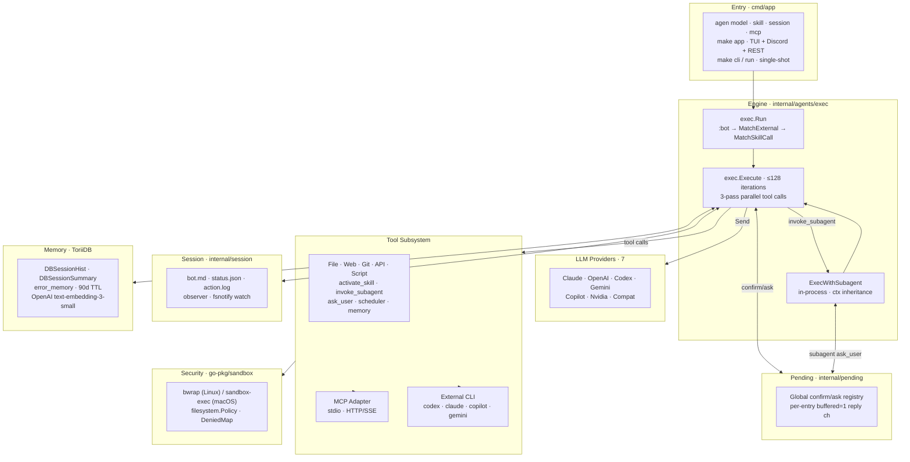

# Architecture

> [中文](https://github.com/agenvoy/Agenvoy/wiki/架構)

A high-level view of how Agenvoy fits together. For per-module diagrams, sequence flows, and the tool-dispatch state machine, jump into the topic-specific pages linked at the bottom of this page.

## Overview

## Layers

| Layer | Package | Responsibility |
|---|---|---|
| Entry | `cmd/app` | argv dispatch (`model` / `skill` / `session` / `mcp` / `cli` / `run`); init env, sandbox, filesystem policy, MCP manager |
| Runtime singleton | `internal/runtime` | server-mode UID lock; SIGTERM prior server on startup |
| Engine | `internal/agents/exec` | iteration loop; tool dispatch; provider routing |
| Subagent | `internal/agents/subagent` | in-process child agent (no HTTP) |
| External agents | `internal/agents/external` | one-shot subprocess wrappers (codex / claude / copilot / gemini) |
| Providers | `internal/agents/provider/<name>` | unified `Agent.Send()` interface |
| Tools | `internal/tools` + adapters | built-in / API / script / MCP tool definitions |
| Sandbox | `go-pkg/sandbox` | OS-native isolation, single entry `Wrap()` |
| Filesystem | `go-pkg/filesystem` (+ `reader/`) + `internal/filesystem` | policy-aware writes; ToriiDB pathing |
| Session | `internal/session` | bot.md / status.json / action.log / fsnotify observer |
| Pending | `internal/pending` | global confirm/ask registry |
| Memory | ToriiDB (`DBSessionHist` / `DBSessionSummary` / `error_memory`) | semantic search + 90-day TTL |
| Scheduler | `internal/scheduler` (+ TUI watcher) | cron / one-shot tasks; hot-reload on file change |

## Cross-cutting principles

- **OS-native sandbox over Go-side filters** — security policy is enforced at the OS boundary; new restrictions go into `go-pkg/sandbox`, not into agenvoy callers
- **Prompt as policy** — permission mode, sensitive operations, and system-prompt protection live in `configs/prompts/`; adding a category means editing the prompt, not the engine
- **In-process over HTTP for subagents** — `invoke_subagent` calls `exec.Execute` directly, sharing the same provider clients, sandbox, pending registry, and memory layer; `AllowAll` and `WorkDir` flow through ctx
- **Read tools fan out, write tools serialize** — concurrency is opt-in and requires both "no side effects" and "upstream allows parallelism"
- **One config layer per concern** — providers in `configs/jsons/providors/`, MCP in `mcp.json`, persona in `bot.md`; each tool author / user touches at most one file
- **Single source of truth per artifact** — `~/.claude/CLAUDE.md` mirrors to the global Obsidian vault; skills mirror between `~/.claude/skills/` and `extensions/skills/`

## Where to read more

| Topic | Page |
|---|---|
| Iteration loop, three-pass dispatch in detail | [Core Concepts](https://github.com/agenvoy/Agenvoy/wiki/Core-Concepts) |
| Provider routing and planner | [Providers](https://github.com/agenvoy/Agenvoy/wiki/Providers) |
| Tool registry, extension paths | [Tools](https://github.com/agenvoy/Agenvoy/wiki/Tools) |
| Memory tiers and semantic search | [Memory System](https://github.com/agenvoy/Agenvoy/wiki/Memory-System) |
| Sandbox policy, permission modes | [Security and Sandbox](https://github.com/agenvoy/Agenvoy/wiki/Security-and-Sandbox) |
| MCP transports, lifecycle | [MCP Integration](https://github.com/agenvoy/Agenvoy/wiki/MCP-Integration) |
| Source of truth for architecture rules | [CLAUDE.md](https://github.com/pardnchiu/agenvoy/blob/main/CLAUDE.md) |
