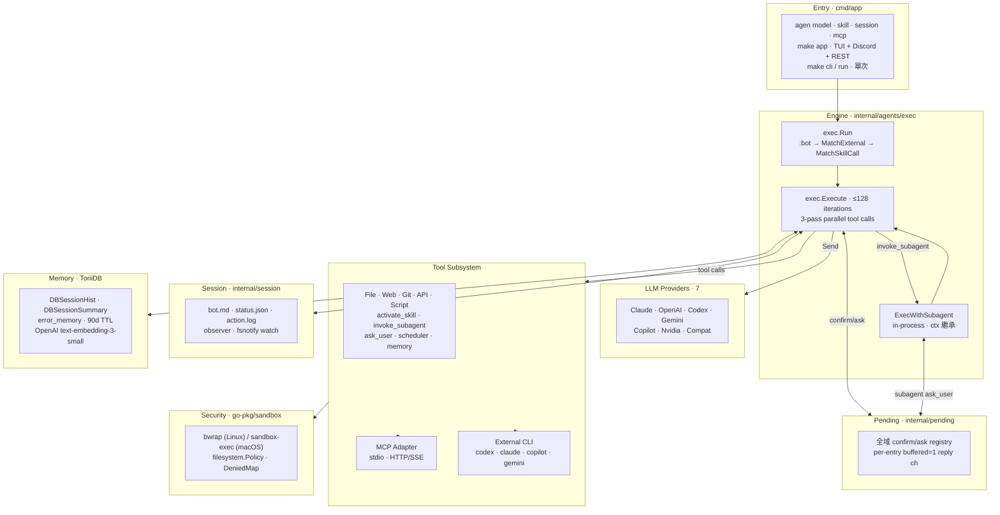

# 架構

> [English](https://github.com/agenvoy/Agenvoy/wiki/Architecture)

Agenvoy 各部分的高階全景。模組級圖、sequence 流程、tool dispatch 狀態機請從本頁底部的主題頁連結進去。

## 概覽

## 分層

| 層 | Package | 職責 |
|---|---|---|
| Entry | `cmd/app` | argv 派發（`model` / `skill` / `session` / `mcp` / `cli` / `run`）；init env、sandbox、filesystem policy、MCP manager |
| Runtime singleton | `internal/runtime` | server 模式 UID lock；啟動時 SIGTERM 前一個 server |
| Engine | `internal/agents/exec` | 迭代迴圈；tool 派發；provider 路由 |
| Subagent | `internal/agents/subagent` | in-process 子 agent（不走 HTTP） |
| External agents | `internal/agents/external` | 一次性 subprocess wrapper（codex / claude / copilot / gemini） |
| Providers | `internal/agents/provider/<name>` | 統一 `Agent.Send()` 介面 |
| Tools | `internal/tools` + adapters | 內建／API／script／MCP tool 定義 |
| Sandbox | `go-pkg/sandbox` | OS-native 隔離，單一入口 `Wrap()` |
| Filesystem | `go-pkg/filesystem`（含 `reader/`）+ `internal/filesystem` | policy-aware 寫入；ToriiDB pathing |
| Session | `internal/session` | bot.md / status.json / action.log / fsnotify observer |
| Pending | `internal/pending` | 全域 confirm/ask registry |
| Memory | ToriiDB（`DBSessionHist` / `DBSessionSummary` / `error_memory`） | 語意搜尋 + 90 天 TTL |
| Scheduler | `internal/scheduler`（+ TUI watcher） | cron／一次性任務；檔案變動熱重載 |

## 跨切原則

- **OS-native 沙箱優先於 Go 端 filter** —— 安全 policy 在 OS 邊界執行；新限制加進 `go-pkg/sandbox`，不加在 agenvoy caller
- **Prompt as policy** —— permission mode、敏感操作、system prompt 保護都在 `configs/prompts/`；加類別只動 prompt，不動引擎
- **Subagent in-process 優於 HTTP** —— `invoke_subagent` 直呼 `exec.Execute`，共享同一份 provider clients、sandbox、pending registry、memory 層；`AllowAll` 與 `WorkDir` 透過 ctx 傳遞
- **Read 工具 fan out、write 工具序列化** —— 併發是 opt-in，須同時「無副作用」+「上游允許併發」
- **每個關注點一層 config** —— providers 在 `configs/jsons/providors/`、MCP 在 `mcp.json`、persona 在 `bot.md`；tool 作者／使用者最多動一個檔
- **每個產物單一 source of truth** —— `~/.claude/CLAUDE.md` 鏡像至 Obsidian vault；skills 在 `~/.claude/skills/` 與 `extensions/skills/` 雙向同步

## 延伸閱讀

| 主題 | 頁 |
|---|---|
| 迭代迴圈、三段式派發細節 | [核心概念](https://github.com/agenvoy/Agenvoy/wiki/核心概念) |
| Provider 路由與 planner | [Provider 設定](https://github.com/agenvoy/Agenvoy/wiki/Provider-設定) |
| 工具 registry、擴展路徑 | [工具系統](https://github.com/agenvoy/Agenvoy/wiki/工具系統) |
| 記憶層級與語意搜尋 | [記憶系統](https://github.com/agenvoy/Agenvoy/wiki/記憶系統) |
| 沙箱 policy、permission mode | [安全與沙箱](https://github.com/agenvoy/Agenvoy/wiki/安全與沙箱) |
| MCP transport、生命週期 | [MCP 整合](https://github.com/agenvoy/Agenvoy/wiki/MCP-整合) |
| 架構規則與限制的真理來源 | [CLAUDE.md](https://github.com/pardnchiu/agenvoy/blob/main/CLAUDE.md) |
