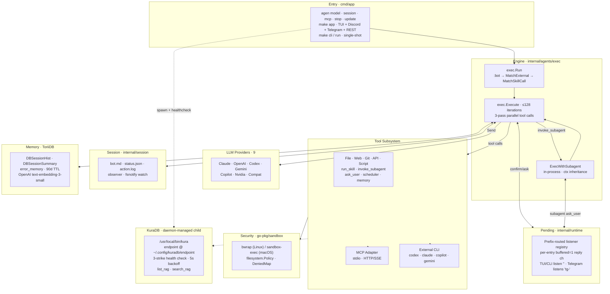

# 架構

Agenvoy 整體如何組合的高階視角。各模組圖表、序列流程與 tool-dispatch 狀態機請跳至各主題專頁。

## 概覽

## 分層

| 層 | 套件 | 職責 |
|---|---|---|
| Entry | `cmd/app` | argv dispatch（`model` / `session` / `mcp` / `cli` / `run` / `stop` / `update`）；初始化 env、sandbox、filesystem policy、MCP manager |
| Runtime singleton | `internal/runtime` | server-mode UID lock；啟動時對先前 server 送 SIGTERM |
| Engine | `internal/agents/exec` | iteration loop；tool dispatch；provider routing |
| Subagent | `internal/agents/subagent` | in-process 子 agent（無 HTTP） |
| External agents | `internal/agents/external` | one-shot subprocess wrapper（codex / claude / copilot / gemini） |
| Providers | `internal/agents/provider/<name>` | 統一的 `Agent.Send()` 介面 |
| Tools | `internal/tools` + adapters | built-in / API / script / MCP tool 定義 |
| Sandbox | `go-pkg/sandbox` | OS-native 隔離，單一入口 `Wrap()` |
| Filesystem | `go-pkg/filesystem`（+ `reader/`）+ `internal/filesystem` | policy-aware 寫入；ToriiDB pathing |
| Session | `internal/session` | bot.md / status.json / action.log / fsnotify observer |
| Pending | `internal/runtime/pending.go` | prefix-routed 的 confirm/ask listener registry；per-runtime listener 透過 `RegisterListener(prefix)`，透過 `PickNextFor(prefix)` 認領 |
| Memory | ToriiDB（`DBSessionHist` / `DBSessionSummary` / `error_memory`）+ go-sqlkit（SQLite FTS5 archive） | semantic search + 90 天 TTL + 全文持久化 archive |
| Scheduler | `internal/runtime/scheduler.go`（+ `runtime.SchedulerWatcher` fsnotify） | 綁定 scheduler skill 的 cron / one-shot 任務；`{tasks,crons}.json` 變更時 hot-reload |
| KuraDB | `internal/runtime/kuradb/`（`kuradb.go` / `run.go`）+ `internal/runtime/kuradb/tool/` | RAG provider 子進程；daemon-managed spawn + 3-strike health check；endpoint 缺失時 per-turn 動態排除 tool |
| TUI | `internal/runtime/tui` | bubbletea inline-chat 前端；設計上為單一 package |

## 橫切原則

- **OS-native sandbox 優於 Go 側 filter** — 安全 policy 在 OS 邊界強制執行；新限制放進 `go-pkg/sandbox`，不進 agenvoy caller
- **Prompt 即 policy** — permission mode、敏感操作與 system-prompt 保護住在 `configs/prompts/`；新增類別意味編輯 prompt，而非 engine
- **subagent 走 in-process 而非 HTTP** — `invoke_subagent` 直接呼叫 `exec.Execute`，共用同一組 provider client、sandbox、pending registry 與 memory 層；`AllowAll` 與 `WorkDir` 透過 ctx 流動
- **read tool 扇出、write tool 序列化** — 並行為 opt-in，且同時要求「無副作用」與「上游允許並行」
- **每個關注點一層 config** — provider 憑證在 OS keychain、已註冊 model 在 `config.json`、MCP 在 `mcp.json`、persona 在 `bot.md`；每位 tool 作者／使用者最多動一個檔
- **每份 artifact 單一 source of truth** — `~/.claude/CLAUDE.md` 鏡像至全局 Obsidian vault；skill 在 `~/.claude/skills/` 與 `extensions/skills/` 之間鏡像

## TUI 設計取捨

> 引 pardn chiu：*「bubbletea 的設計不是要拆成互相 reference 的獨立模組——拆了會讓 lifecycle 一團亂。我現在沒餘力處理它。」* 此模組刻意保持不切分。

TUI 住在單一 package（`internal/runtime/tui`），**不**拆成子 package。`internal/runtime/tui/` 底下每個檔案都遵循此原則。

### 為何選 bubbletea（而非 tview / tcell）

先前的 TUI 用 `rivo/tview`，被替換的原因：

- **Inline scrollback**：bubbletea 的 `tea.Println` 寫出的行會捲進 input box 上方 terminal 原生 buffer。tview 佔據整個螢幕，無法與 shell scrollback 共存。
- **lipgloss styling primitives**：border、padding、foreground/background 組合乾淨。tview style 為 tag-based，跨 component 重用較難。
- **bubbles 生態系**：`textarea`、`spinner`、`cursor` 是即插即用的 component，與 charm-bracelet 風格其餘部分一致。

代價是 bubbletea 為 [The Elm Architecture](https://guide.elm-lang.org/architecture/) 的 Go port——其 `tea.Model` 介面設計上即為 monolithic。

### 為何單一 package

`tea.Model` 要求 `Update(tea.Msg) (tea.Model, tea.Cmd)` 為 model type 上的 method。Method 必須與 type 住在同一 package。這強制：

- 所有 `Update` 邏輯與 model 同 package
- 拆成子 package 需要在第三個（root）package 建 wrapper，並匯出**每一個** model field 讓子 package 能讀寫 state
- 目前 `popupState`、`commandPickerState`、`viewMode` 等 `unexported` type 必須變成 exported，形成一個 `internal/runtime/tui` 外部永遠不會消費的「API」
- `send()` 與 `program atomic.Pointer[tea.Program]` 要嘛移進子 package（root 透過 setter API 設定），要嘛留在 root 並強迫 handler import root，這會造成第二個 cycle

真正 Go 風格的 TUI 會建 per-domain widget package（各自持有 state struct、render method 與 event handler），bubbletea 僅作為 event loop。該重構為 600-800 LOC 的重寫，切成 4 個 phase。對目前約 1.1k LOC、由單一開發者維護的 TUI，收益不足以正當化成本。

### 何時重新檢視

當**任一**條件成立時，切換為 per-domain widget package：

- TUI 超過約 3k LOC，且 code review 持續卡在「這該歸屬哪裡」
- 多位開發者常態觸碰 TUI 並互相踩 state
- 特定 widget 需針對凍結 state 做獨立 unit test——目前不實例化整個 `Model` 就辦不到

***

> [!NOTE]
> 本文件由 Claude 讀完完整原始碼後自動生成。
